# 1. Setting up development environment
## 1.1. Overview
In this lab, we will learn how to setup an environment to start developing Machine Learning (ML) Solutions on Azure Machine Learning (Azure ML) service with native modules, R and Python scripts. Microsoft Azure ML is a cloud service that has ready to use templates, APIs as a solution to various problems such as fraud, anomaly detection, sentiment analysis, face recognition etc. Along with these APIs, it is also possible to develop custom solutions with custom algorithms even by integrating custom R or Python scripts.  

Azure ML is a subscription based online service that can be accessed through a regular web browser. It provides [guest, free and standard tier services](http://blogs.technet.com/b/machinelearning/archive/2015/04/29/guest-access-guided-tour-amp-experiment-tutorial.aspx). With some limitations, guest access doesn’t require any login process. With few clicks, without an account, you can start to develop ML solutions. Other tiers require a Microsoft account and we will develop most of our experiments, R and Python scripts on free or standard tier environment. Main difference between the free and the standard account is the performance. Free account has resource limitation which will result in low performance, low execution speed in experiments. To have a general knowledge on other platforms, we will also setup R and Python app development environments.

### 1.1.1. Objectives
This lab will show you how to:
* Setup free Microsoft Azure ML workspace
* Setup Azure ML workspace within an existing Azure subscription
* Setup Python development environment
* Setup R development environment

### 1.1.2. Requirements
You must have the following to complete this lab:
* Windows, Mac or Linux machine
* Web browser
* Microsoft Account (signup at https://signup.live.com) 

## 1.2. Create free tier Azure ML account
Free Azure ML account is enough to create most of the experiments throughout the labs. Following instructions will work on major web browsers on Windows, Mac and Linux environments.

1. Browse to https://studio.azureml.net and click on the “Sign In” link  
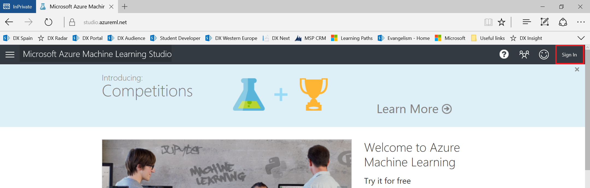

3. Enter your Microsoft account to create a free Azure ML workspace.  
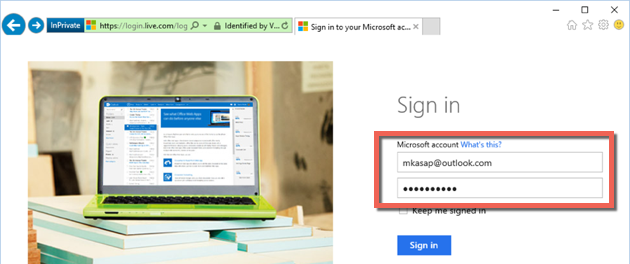

4. You can watch the Azure ML tutorial video at the landing page to have a quick overview about the Azure ML service. This will open the page where we will develop our Azure ML experiments in the next labs.  

## 1.3. Create standard tier Azure ML account
Standard tier Azure ML account is another option with more flexibility. One of the major difference of this tier is that you can scale the resources to increase the execution performance of the experiments. You can use either free or standard tier in our labs but standard tier requires an Azure subscription which depends on additional requirements. You may create Azure subscription with “Free Trial” option. Free trial is valid for one month and have prepaid $200 credit available to be used in any service available (including Azure ML). After one month, your account will be suspended and later will be deleted. After one month, before your account disabled, you can remove the spending limit on your account to continue using Azure services. Once your account disabled, all your data, experiments etc. will be deleted. Only one trial account can be created during the life of a single Microsoft account.  

1. Browse to https://azure.microsoft.com  
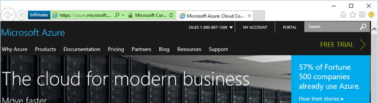

2. Click “Free Trial” link  
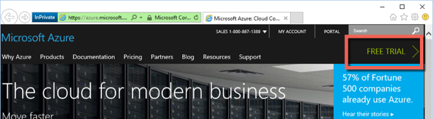

3. Once again click on the “Try it now” button  
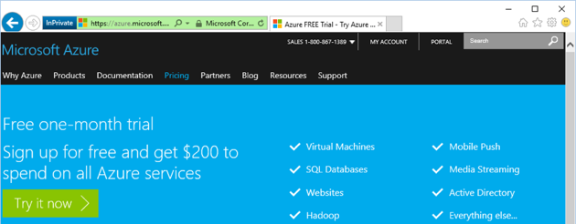

4. Enter your Microsoft account (hotmail, outlook etc.) username and password  
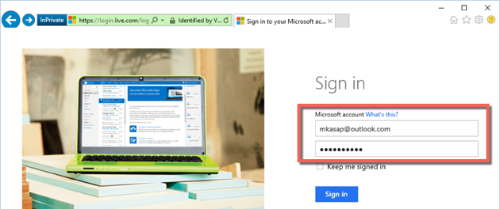

5. Select your country from the list and click on the “Continue with the current offer (Free Trial)” link.  
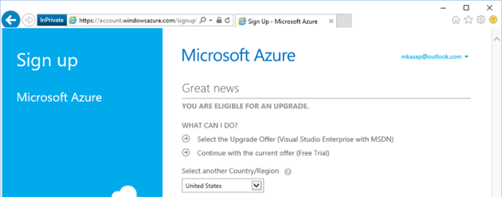

6. Fill in the 4 step form. 1st step “About you” section with your info. In 2nd step, verify your phone number by clicking the “Send Text Message” button after entering your phone number. Enter the verification code to the form that will be sent to your mobile phone.  Now go to 3rd step, “Verification by card”. Enter your credit card details. Credit card information is collected only to verify your identity. You will not be charged unless you explicitly upgrade to a paid offer. Finally, in 4th step, accept the agreement and click “Sign Up” button.  
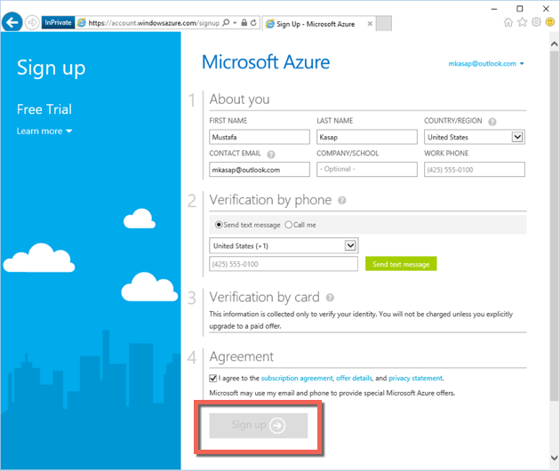

7. Welcome to Microsoft Azure. Click on the “Start managing my service” link.  
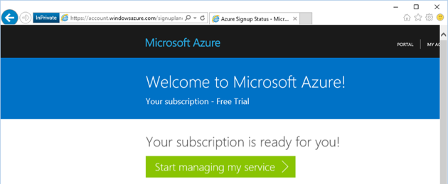

8. Now you are landed on the azure management portal page, where you can see the list of services available for you. Scroll down, select “Machine Learning” and click “Create an ML Workspace” links in order  
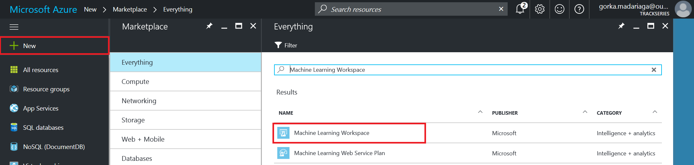

9. In the new window, enter a unique name to your Azure ML workspace and to your storage account. Click on the “Create an ML workspace” link.  
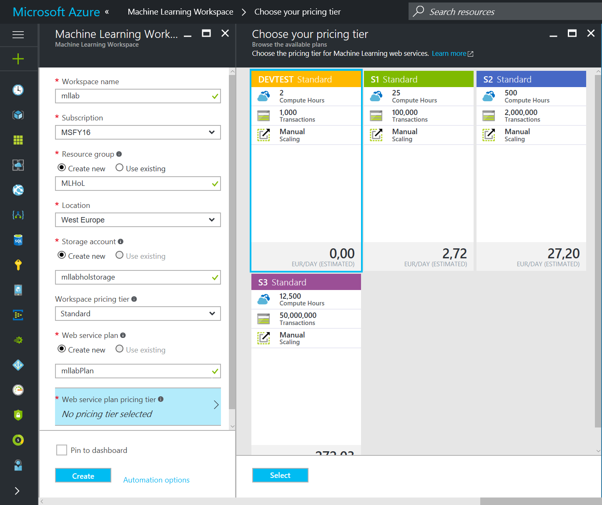

10. Once your workspace created and the status became “Online”, you can click on the “Open In Studio”. This will open the page where we will develop our Azure ML experiments in the next labs.  

## 1.4. [OPTIONAL] Install R and R Studio
This installation is completely optional. In a basic Azure ML solution development, you will not need local R tools or the Python tools. All features you will need are included in Azure ML Studio. With these installations we will be doing some of the experiments locally for comparison reasons and also to show widely used tools in the community.  

R is a language and environment for statistical computing and graphics with an active and large user community. Hundreds of free, open source R libraries available for use. In addition, there exists various open source free IDEs one of which is R Studio. Azure ML supports running custom R scripts and in some parts of the labs, we will be using R Studio to test the code locally.  
 
R Studio is an integrated development environment, set of integrated tools designed to help you be more productive with R. It includes a console, syntax-highlighting editor that supports direct code execution, as well as tools for plotting, history, debugging and workspace management. RStudio requires R 2.11.1 (or higher) so we will start the process with R installation.  

Follow the below steps to install R and R Studio in order.  

1. Browse to https://cran.rstudio.com 
2. Select the appropriate OS environment link to download and install the R binaries.
3. If needed you can follow the installation instructions at the same page.
4. Browse to https://www.rstudio.com/products/rstudio/download/
5. Depending on your OS type, download and install the latest version of the RStudio from the list.

Once the installation complete, you can launch the R Studio and start coding in R.  

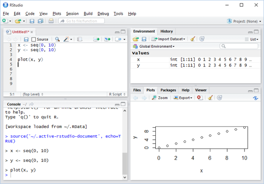

## 1.5. [OPTIONAL] Install Anaconda Python
This installation is completely optional. In a regular Azure ML solution development, you will not need local R tools or the Python tools. All features you will need are included in Azure ML Studio. With these installations we will be doing some of the experiments locally for comparison reasons and also to show widely used tools in the community.  

Anaconda is a completely free and open source Python distribution including the Python 2.7 and 3.5 bases.  
1. Browse to https://www.continuum.io/downloads
2. Install Anaconda Python 2.7 by selecting the appropriate OS environment.

Once the installation completed you can start developing Python code through Spyder or command prompt.  

## 1.6. Install Microsoft Excel
In the upcoming lab sessions, for generating synthetic data, we will be using Microsoft Excel application because of its simplicity and quick visualization capabilities. In case you want to play on the synthetic data, modify it or develop your own algorithms to produce raw data it is higly recommended to install Microsoft Excel or similar tool. You can download and install one month free trial version of the product from [https://products.office.com/en-us/try](https://products.office.com/en-us/try)