# 3. AzureML Experiments & Data Interaction
## 3.1. Overview
In this lab, we will use AML input modules to read dataset from various sources that we created in the previous lab. We will explore the ways to connect different data sources, retrieve data, get basic statistics and basic data visualization techniques. This will be a basis for the next sessions where we will be developing ML solutions for the problems.  

### 3.1.1. Objectives
This lab aims to demonstrate methods to access different data sources, retrieve data and get basic statistic information about the retrieved data.  

### 3.1.2. Requirements
Must complete previous lab session to have datasets ready for access.

## 3.2 Creating AzureML Experiment
In this session we will create our first AML experiment and get used to the AML Studio environment.  

1. Launch https://studio.azureml.net portal as mentioned in the previous labs.  

2. Once you successfully logged in, click on the “+ NEW” link to create a new blank experiment.  
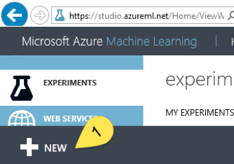  

3. Click on the Experiment link on the left (if not already selected) and then click “Blank Experiment” tile.  
  

4. In the new window on the left you can see the available modules that you can use to develop your AML experiment. These modules are categorized under headings like “Data Input and Output” or “Machine Learning” etc. Because there exist many modules, sometimes it may be difficult to find the one within others. In that case just type few letters of the module name in the Search box on the left top corner to quickly access it.  
To develop an experiment, you drag and drop modules on the experiment canvas, connect them each other, set each module’s properties first by selecting the module then setting properties on the window at the right side, after all you can save the experiment and run it.  
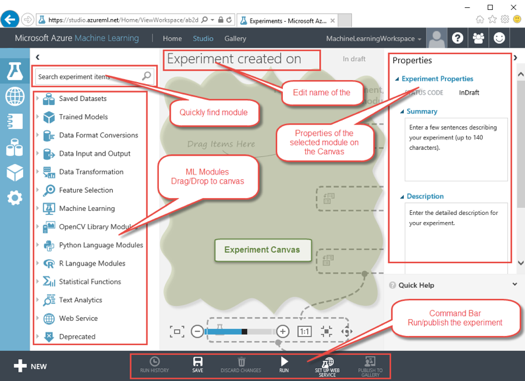  

5. Drag and drop two modules on the canvas. First module is named “Reader” (now re-named to "Import Data") under the Data Input and Output category, second module is named “Execute R Script” under R Language Modules category.  
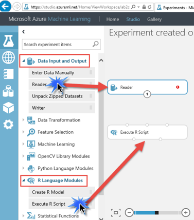  

6. As you can see each module has at least one input or output port or both. Output ports are at the bottom, input ports are at the top of the module. i.e. Import Data has one output port  
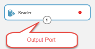  
And “Execute R Script” module has 3 input, 2 output each for specific purposes.  
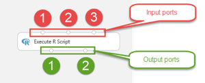  

7. Like the exclamation mark in the reader module, in each module you can see a sign (red exclamation mark or green check mark) on the right side of the module. Which means there is a problem with this module or if it is fine. If there is no mark, it means you haven’t run it yet, so no clue about its status yet.  
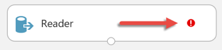  

8. Click on the reader module to make it selected. Same for all other modules, once it is selected, the border and its ports gets highlighted, properties window updated to show the selected module’s properties.  
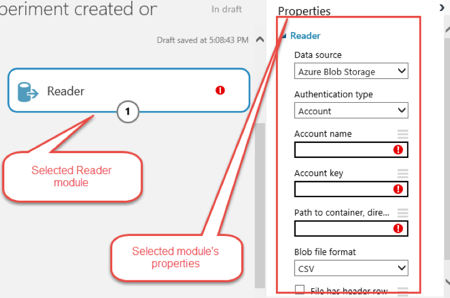  

9. If you want to get quick and detailed help about any module, you can check the quick help section in the properties window of the selected module. By clicking on “More help…” link, you can launch a browser window to open detailed description of the selected module.  
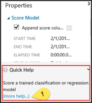  

10. There is also a progress notification area on the bottom of the AML Studio window. In case there is background job running or if there is a notification, it will be shown in this area.  

## 3.3. Accessing Data
In this session we will develop simple Azure ML experiment without any function but just to import data from different sources such as Azure SQL Database, Azure Storage, Manual Input, URL Reader etc. Later on we will be using these datasets for developing ML solutions.  

### 3.3.1 [OPTION A] Access data, use existing dataset
1. Click on Datasets link and then switch to Samples tab. Here you can find pre-installed sample datasets that are ready to be used in your AML experiments. This step is prepared just to show the location of the sample dataset list.  
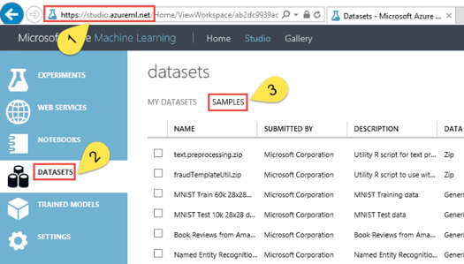  

2. To start creating a blank experiment, click on the NEW link on the bottom left corner of the page.  
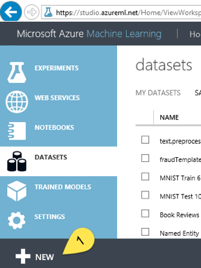  

3. Click on the Experiment link on the left (if not already selected) and then click “Blank Experiment” tile.  
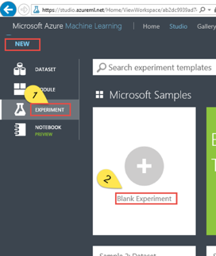  

4. On the left window, expand in order “Saved Datasets” and “Samples” nodes. Under the samples node, you will see the list of pre-installed datasets that we browsed in step 2.  
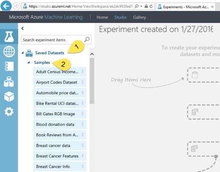  

5. Find the “Automobile price data (Raw)” dataset module under the samples node, drag and drop it on the experiment’s canvas.  
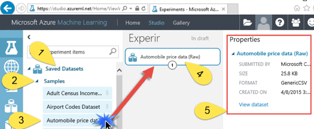  
If you don’t click anywhere else, this module on the canvas will be selected by default. Now on the right window you can see the properties of the selected module. For this simple dataset module, only read-only properties such as size, format and a download link (“view dataset”) available.  

6. Apart from properties window, you can interact with the module through the output ports. Some modules require the experiment to be “RUN” before being able to interacted. Click on the output port of the module. Pop-up menu will become visible. Select the “Visualize” command on the pop-up menu.  
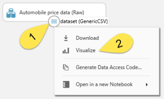  

7. “Visualize” command will launch a new pop-up window with data preview and some statistics/visualization about the data on the selected column.  
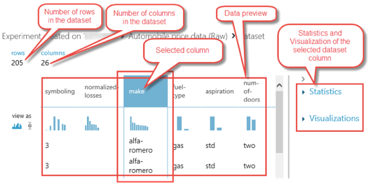  

8. Expand the statistics and visualization information area on the right. Select column “make” in the data preview area shown on the previous screenshot. Here you can find the minimum, maximum values, number of unique values etc. in the selected column data. Also you can analyze the distribution of the data with histogram like charts under visualization area.  
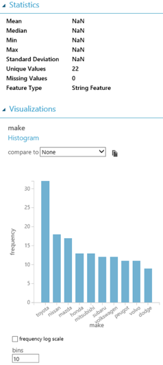  

9. In the above example, statistical values are NaN because we selected a column with alphanumeric values. If you select another column with just numeric values, this field will be dynamically updated.  
Looking to the histogram, we can say that the number of Toyota cars is much more than Dodge in the dataset or the distribution of the “make” is not equal (Toyota much more than others, Nissan is a bit more than Volvo etc.)  

### 3.3.2. [OPTION B] Upload your own dataset
In the previous example we used pre-installed sample dataset. In this session we will be importing our own dataset that is stored in our local machine. The local dataset that we created in the previous lab session.  

1. To upload locally stored dataset, click on the “NEW” button on the bottom left corner of the AML studio.  
  

2. Click on the “Dataset” menu item and then “From Local File”.  
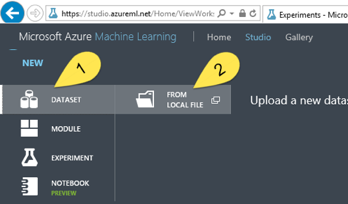  

3. In four step, click on the “Browse…” and locate the linoise.csv file that we generated in the previous lab session. Enter a new name if you want to change the default filename, select the file type (which is CSV in our case and selected by default) and finally click on the checkmark button on the bottom right corner to start uploading the file.  
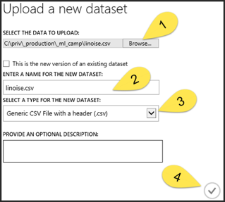  

4. One the file uploaded successfully, create a blank ML experiment and expand the nodes in order “Saved Datasets” and “My Datasets”. You will find the uploaded file under the “My Datasets” node. Drag and drop it on the experiment canvas.  
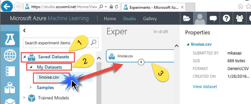  

5. Click on the output port of the “linoise.csv” dataset module and select “Visualize”. We will come back to statistics in the future sessions but for this simple dataset it is a good point to dive a little bit. In order, select the “X” column of the dataset then under the visualizations area, select “ywnoise” to compare its values with column x. You will see the same plot on our Excel, Python and R experiments.  
If you look at the below image, statistics about the x column says that the minimum value is 1, maximum is 30, mean median is 15.5 and Feature (column) type is “Numeric Feature”. Here you may think that we all know this for this simple, small dataset. But if you will have larger dataset, you may want to get all this information in a single shot. At least you may want to know that if all rows in the selected column contains numeric values (Feature Type) or not, is there any missing value in one of the rows within million?  
Also under visualization area, you will see the x vs. ywnoise plot. This plot will tell you in first hand that these two features (columns) “x” and “ywnoise” are strongly dependent. Which we will talking more about its meaning in the upcoming sessions.  
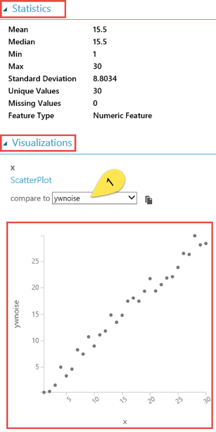  

### 3.3.3.	[OPTION C] Upload your own compressed dataset
1. In the previous section, we uploaded the CSV file into Azure ML workspace. What if the size of CSV file is very large where it is possible to compress it into ~1/10 of its original size? Azure ML can also handle compressed ZIP files. Just compress the “linoise.csv” into “linoise.zip” and also upload to ZIP version into Azure ML workspace.  

2. First, drag&drop the compressed file module “linoise.zip” on to the experiment canvas. Second also drag&drop “Unpack Zipped Datasets” module from the “Data Input and Output” node under module toolbox. Finally, connect these two modules to each other.  
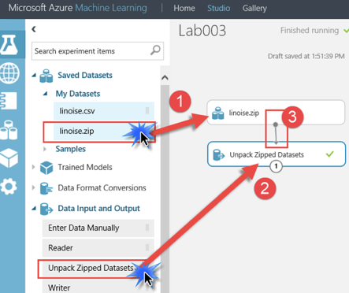  

3. Select the module “Unpack Zipped Datasets”. Switch to the properties window and made appropriate settings as shown below.  
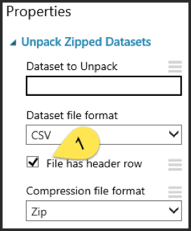  

4. “Run” the experiment and click on the output port of the “Unpack Zipped Datasets” module to visualize the values.

### 3.3.4. [OPTION D] Manually enter data
Another method that you may prefer to provide data into your AML experiment is to enter the data manually. Which is the general case for small amount of data. In this session we will explore this feature of the AML studio.  

1. Create a blank experiment in AML Studio. Drag and drop an “Enter Data Manually” module on to the experiment canvas from the “Data Input and Output” node in the module toolbox. Set “Enter Data Manually” module’s properties, so the DataFormat is “CSV” and “HasHeader” option checked.  
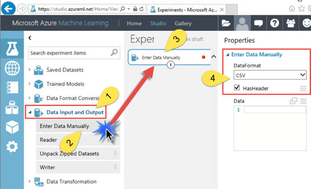  

2. Open the excel file that we created for a sample dataset in the previous lab. Copy the 31 rows of the columns D, E and F as shown below.  
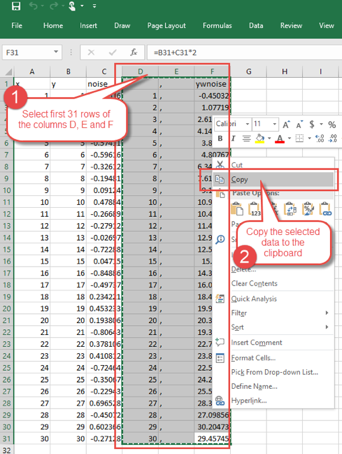  

3. Now switch back to AML Studio. Make sure the “Enter Data Manually” module is selected. On the properties window, right click inside the empty “Data” textbox, paste the values that we copied from Excel.  
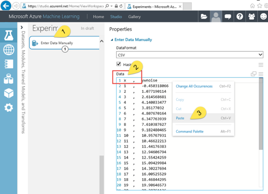  

4. Be sure that there is no empty 32nd row in the pasted data. By default Excel put a new line at the end of the copied data.  
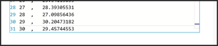  

5. Now click on the output port of the “Enter Data Manually” module. In the pop-up menu you will see that the “Visualize” command is disabled.  
As we mentioned previously, some components become ready after you run the experiment.  
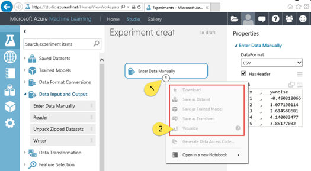  

6. Run the experiment.  
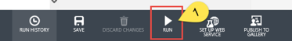  

7. After few seconds you will see a message near the experiment name writing “Finished Running” and after this successful run, you will also see a green check mark on the right side of the “Enter Data Manually” module. And finally when you click again the output port of this module, you will see the enabled “Visualize” command.  
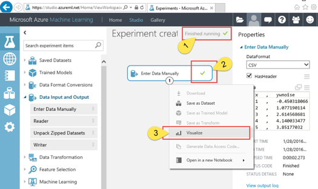  

### 3.3.5. [OPTION E] Access data on Azure Storage
In this session we will explore the possibility to access data that is stored on the cloud, Azure Storage service.  
1. Create a blank experiment in AML Studio. Drag and drop a “Reader/Import Data” module on to the experiment canvas from the “Data Input and Output” node in the module toolbox.  
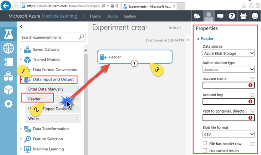  

2. Set “Reader/Import Data” module’s properties. Under “Data source” combobox, select “Azure Blob Storage” which is default selection. Under “Authentication type” select “Account” as we haven’t set the container public in the previous lab. So we need to provide access key. Under “Account Name” and “Account Key” properties, type the corresponding values that we mentioned in the previous lab under section “Azure Storage”.  
More important, set the textbox under “Path to container, directory or blob” label with the name of the container/blob that you used in the previous lab. This field is case sensitive so type exactly the same values that you used in the previous lab.  
Because our file has header (column names “x” and “ywnoise”) select the “File has header row” checkbox. And because we don’t want Azure experiment to read the data from Azure blob storage service each time we run the experiment, we check the “Use cached results” checkbox.  
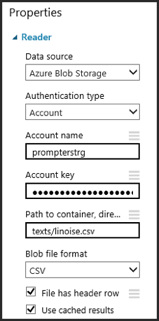  

3. When you click on the output port of the “Reader/Import Data” module, again you will see that the “Visualize” menu item is disabled. To have it enabled, just run the experiment. Dataset will be ready for use.

### 3.3.6 [OPTION F] Access data on Azure SQL Database
In the previous lab, we have used a TSQL script to create a table with some values in it. Now we will explore the steps to access data stored in the Azure SQL Database.  
1. As in the previous section, create a blank experiment in AML Studio. Drag and drop a “Reader/Import Data” module on to the experiment canvas from the “Data Input and Output” node in the module toolbox.  

2. Set “Reader/Import Data” module’s properties. Under “Data source” combo-box, this time select “Azure SQL Database”. Again referring to previous lab, use the Azure SQL Database connection string values to fill the rest of the properties. Type the “Database server name”, “Database name”, “Server user account name” which all under the database connection string that you can access in the Azure Management Portal that we explained in the previous lab. Only the password is not available which you have to know in memory and type the password in “Server user account password” field.  
Here “Server user account name” value must be same as in the connection string, in a format like username@servername  
Finally type the appropriate TSQL script under “Database Query” textbox to retrieve the desired dataset from the database. In this lab, we will type:  

    ```sql
    SELECT * FROM [dbo].[synth_data]
    ```  

    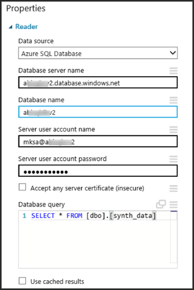  

3. If your data is not changing rapidly, you can select the “Use cached results” check-box for a better performance.  

4. Again you cannot visualize the dataset via output port before running the experiment initially.  

### 3.3.7 [OPTION G] Get data from an HTTP web request
Finally, we will explore the steps to access data retrieved using an HTTP web request who could belong to your service API set.  
1. As in the previous section, create a blank experiment in AML Studio. Drag and drop a “Reader/Import Data” module on to the experiment canvas from the “Data Input and Output” node in the module toolbox.

2. Set “Reader/Import Data” module’s properties. You just need the endpoint URL to be requested and the format in which data results would be retrieved. Use the checkboxes below to select whether your data has headers or not and the possibility to use cached results if the data retrieved won't be changing too much, so the request hasn't need to be done each time you run your experiment.

    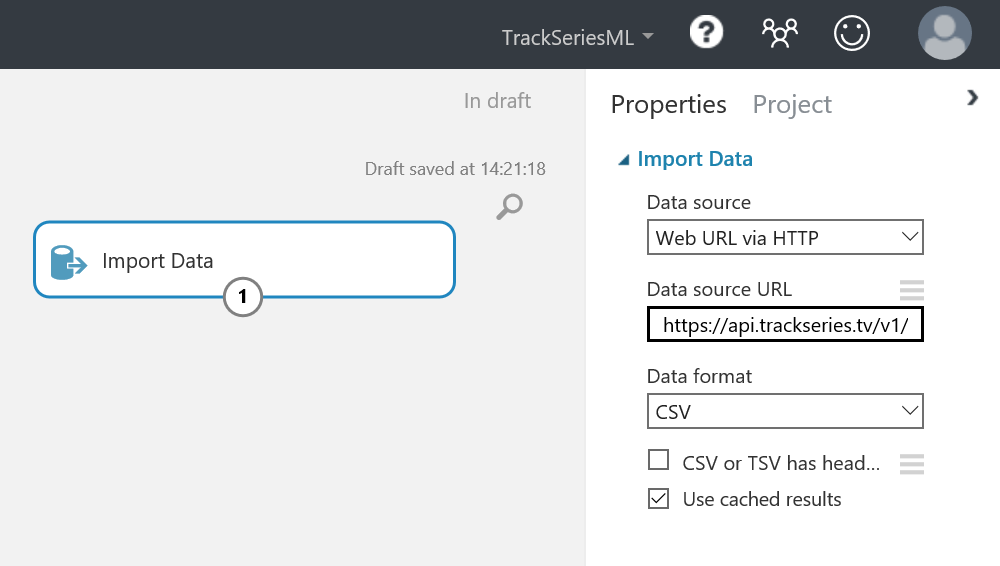  