# 5. Custom Scripts (R & Python) in AML
## 5.1. Overview
In this lab we will convert the R & Python codes that we executed on our local machines in the first lab session of this hands-on lab series. Idea is to show the capability of running native R & Python code in Azure ML experiment. Explore the customization features of Azure ML experiments. This knowledge can be used to integrate local or third party R & Python scripts, libraries, workspaces etc. into Azure ML experiment.  

### 5.1.1. Objectives
This lab aims to demonstrate how to run R & Python scripts within Azure ML workspace, point compatibility issues and customize Azure ML experiments through custom R & Python scripts.  

### 5.1.2. Requirements
Basic R and Python scripting skills.  

## 5.2. R & Python Script Modules
In the previous labs we used local Python and R development environments to synthetize experiment data. In this section we will use R and Python script modules that exist in Azure ML workspace to generate this data within the Azure ML workspace itself.  

### 5.2.1. Using Execute R Script module
R script module is used to execute almost all of the R scripts that you can run in your local R environment.  

1. Create a blank Azure ML experiment.  

1. From the module toolbox, drag&drop “Execute R Script” module which is under “R Language Modules” node.  
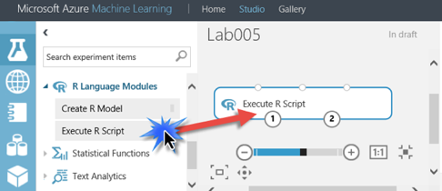 

1. “Execute R Script” Module has three input, two output ports as numerated below. First and second ports are used to stream two datasets as input, third port is used to stream a compressed script bundle as an input. This script bundle may contain dataset, third party R libs etc. Fourth port is the data output port and the fifth port is the R device output port, where you can output R plots etc.  
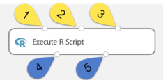 

1. Select the “Execute R Script” module and switch to the properties window. Under the “R Script” section you will see the template code which shows you the way to access the above mentioned 5 ports.  
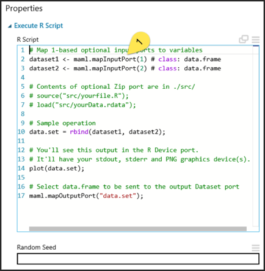 

1. In this section, we will not get any input value but produce just output. Select the existing text in “R Script” editor window and delete them all.  

1. Type the following lines of R Code into the “R Script” window which is almost the same as the one that we run locally in the previous lab.
```r
# Generate synthetic data
x <- seq(1, 30)
y <- x
noise <- runif(30, -1, 1)
ywnoise <- y + noise * 2
# plot point cloud on a chart
plot(x, ywnoise, xlab = NA, ylab = NA)
# combine two columns to create data grid
linoise <- cbind(x, ywnoise)
linoise <- as.data.frame(linoise)
# Select data.frame to be sent to the output Dataset port
maml.mapOutputPort("linoise");
```

1. “Run” this simple experiment which consist of a single “Execute R Script” module.  

8. After a successful execution, click on the first output port, then select the “visualize” menu item on the pop-up menu window. You will see the similar dataset that we generated in the previous lab.  
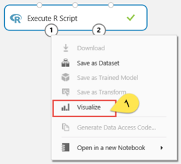 

9. Now click on the second output port (R Device output) and visualize it. You will see all device outputs in this visualization page.  
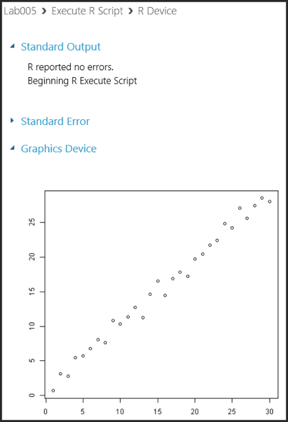 

### 5.2.2. Using Python Script module
Similar to R, Python script module is used to execute most of the Python scripts that you can run in your local Python environment.  

1. Create a blank Azure ML experiment.  

2. From the module toolbox, drag&drop “Execute Python Script” module which is under “Python Language Modules” node.  
 

3. Like the “Execute R Script” module, it has three input and two output ports with the same functionality.  

4. In the properties window of the “Execute Python Script” module, again you can find a template Python code to access the data stream in these ports.  
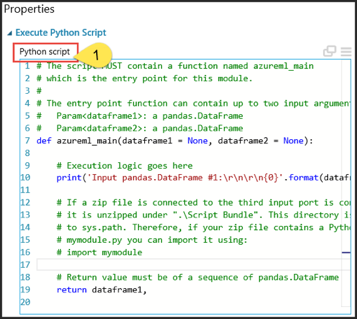 

5. Delete the template code and enter the following Python script into the textbox.
```python
import matplotlib
matplotlib.use('agg')
import numpy as np
import matplotlib.pyplot as plt
import pandas as pd
def azureml_main(dataframe1=None, dataframe2=None):
    x = range(1, 31)
    y = x
    noise = np.random.uniform(-1, 1, 30)
    ywnoise = y + noise * 2
        
    d = {'x' : np.asarray(x), 'ywnoise' : ywnoise}
    linoise = pd.DataFrame(d)

    fig = plt.figure()
    ax = fig.gca()
    linoise.plot(kind='line', ax=ax, x='x', y='ywnoise')
    fig.savefig('linoise.png')

    return linoise
```

6. After a successful “RUN” of the above code in the “Execute Python Script” module, click on the second output port and visualize the output.  
 

### 5.2.3. R & Python compatibility with Azure ML
There exist different versions of R and Python environments. Some 3rd party libraries run only in specific environment version. What if we want to move our local R|Python code into AzureML workspace? How we can be sure about the compatibility? It is better to check the version of both the local and AzureML environments.  
1. Open the R Studio local application. Installation steps for this app mentioned in Lab 1.  

2. In the console window type command “version” as shown below and press ENTER.  
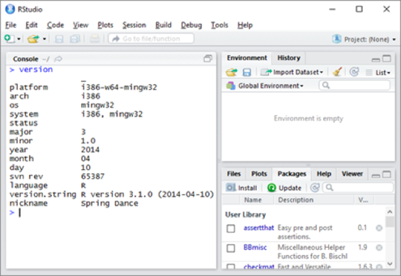 

3. Result will be a list of information about the installed R environment. In the above window, it is shown that the R environment _version is 3.1.0_

4. Switch to Azure ML Studio in your browser and create a blank ML experiment.  

5. Drag&drop an “Execute R Script” module on to the canvas.  
  

6. Enter the following R script into the editor of the “Execute R Script” module.
```r
v <- version 
property <- as.character(names(v)) 
value <- as.character(v) 
data.set <- as.data.frame(cbind(property, value))
maml.mapOutputPort("data.set");
```  

7. “RUN” the experiment and visualize the first output port of the “Execute R Script” module.  
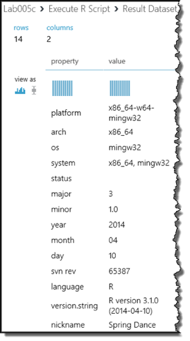  
Output value is same to the one that we get from the local R environment. Which means almost all of the scripts that run locally can run in Azure ML also. Don’t forget that there exist some limitations in Azure ML because of security reasons.  

8. Similar to version information, it is possible to get the list of installed R packages in Azure ML Studio. R packages are used to access and integrate various functionalities, libraries into your R script. Create a new blank Azure ML experiment.  

9. Drag&drop a new “Execute R Script” module. First delete the existing script then enter the following R script through the R script editor in its properties window.  
```r
data.set <- data.frame(installed.packages()) 
maml.mapOutputPort("data.set")
```

10. “RUN” the experiment, click on the first output port and visualize the output.  
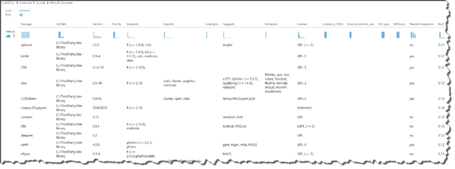  
It is possible to download this data through “Convert to CSV” like module.  

11. Drag&drop “Convert to CSV” module from the “Data Format Conversions” node path under the module toolbox window. Connect the “Execute R Script” module’s first output port with the “Convert to CSV” module’s input port.  
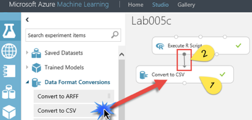  

12. “RUN” the experiment once again.

13. Click on the output port of the “Convert to CSV” module and select “Download” command in the pop-up menu.  
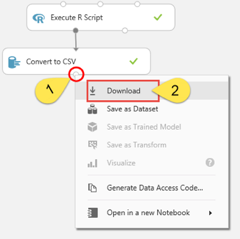  

14. You can open the downloaded file in Excel like spreadsheet program.  

15. Similar to R environment, it is possible to get the version information of the Python environment. As in the “Execute R Script” module, drag&drop “Execute Python Script” module into a new blank Azure ML experiment and enter the following Python script into its editor.  
```r
import pandas as pd
import sys
def azureml_main(dataframe1 = None, dataframe2 = None):
    prop = ['major', 'minor', 'micro', 'releaselevel', 'serial']
    val = sys.version_info[:]
    d = {"prop" : prop, "val" : [str(v) for v in val]}
    df = pd.DataFrame(d)
    return df,
```  

16. “RUN” the experiment and visualize the output through the first output port. Version of the Azure ML python environment is _2.7.7_  
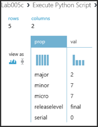  
