# 6. Evaluate model performance in AML
## 6.1. Overview
In this lab we will explore the methods used in AML to evaluate the performance of models. We will answer the questions like “How precise is your model?”, “Which model is better?”, “Which features we should use?”  

### 6.1.1. Objectives
This lab aims to demonstrate how to use the AML performance evaluation modules, their outputs, general approach to set parameters of a model.  

### 6.1.2. Requirements
Completion of previous lab sessions or basic AML knowledge.  

## 6.2. Performance evaluation
AML supports model evaluation through two modules named: “Evaluate Model” and “Cross-Validate Model”. In this session we will explore their features and helper modules for model evaluation.  
Model training is based on an existing data. After training the model, it is best practice to evaluate its performance, precision though different parameters. To evaluate a model, you should have known input (x) and output (y) values which may be called evaluation dataset. Providing just the input values in the evaluation dataset, you get the predicted (scored) output, call it y_predicted. Because you know the original corresponding “y” value of the input “x”, you can manually check the difference between “y_predicted” and y values. If “y_predicted” is very close to “y” then it means the model is precise, predicting correctly, If abs(y – y_predicted) is >> 0 then not precise.

### 6.2.1. Splitting data
Because we have only one existing dataset, we should extract a small portion of this data set to be used as “evaluation dataset”. For extracting a portion of a dataset we use “Split” module.  
What portion of the data should we extract as “evaluation dataset?”: General approach is %40 - % 15 which is not a rule and varies depending on the algorithm, method or size of the data used.  

1. Create a blank Azure ML experiment.  

2. From the module toolbox, drag&drop “linnoise.csv” saved dataset module.  

3. From the module toolbox, drag&drop “Split Data” module which is under “Data Transformation” -> “Sample and Split” node path. Connect the output of the “linoise.csv” module with the input of “Split Data” module.  
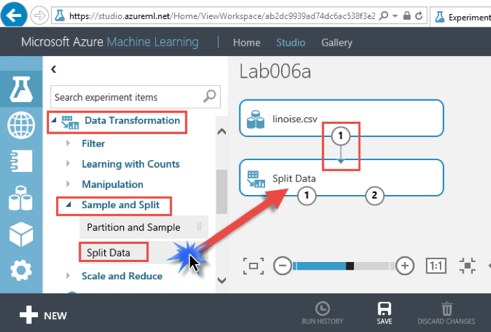  

4. “RUN” the experiment and visualize both output ports of the “Split Data” module. In each visualization, select the “X” column to get statistics about it.  
First output port:  
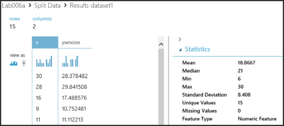  
Second output port:  
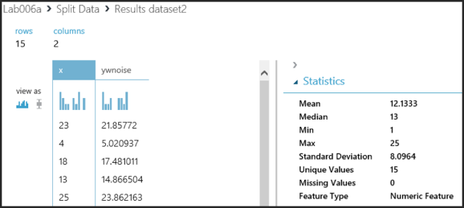  
5. Select the “Split Data” module and switch to its properties window.  
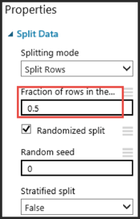  

6. You will see the default parameters set as: “Splitting Mode” is “Split Rows” which means the input dataset is divided horizontaly. “Fraction of rows in first output dataset” property is 0.5, which means the half of the rows will output in the first output port, the rest will be in the second output port. As we have 30 rows of data as input, 15 rows will stream to first output, the rest 15 will be on second output. Because the “Randomized split” checkbox is checked, random 15 rows fill be selected. If you “RUN” the experiment several times, you will notice that the output will not change even it is randomized. It is because we are using the same “Random seed” every time. You may consider providing “Random seed” as web service input to make it parametric or change it manually.  

7. What if we want to split the data into three portion? i.e. %60, % 20 and %20 solution is to nest two split modules.  
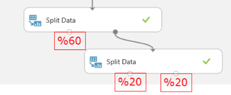  

### 6.2.2. Scoring the model
In the previous lab, we developed an experiment to train a model for making predictions. We used web service to test the trained model’s performance. The output of the web service (trained model) seemed to be fine as we already know the pattern/relation between input and output. What about if we don’t know the relation and how we evaluate the performance in a more efficient way? “Score Model” module is one of the components designed to evaluate trained models performance.  

1. From the “Experiments” tab open the previous experiment that we developed for training a model and publishing as a web service.  
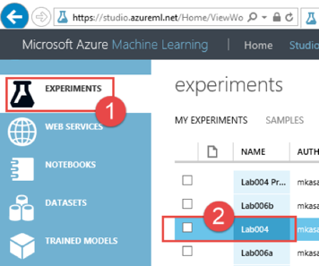  

2. Click on the “Save” button on the bottom control bar and then select “Save as” to create o copy of this experiment.  
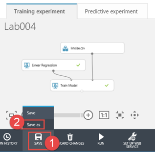  

3. After creating a copy with “Save as” command, you can change the copied experiments name. Drag&drop a “Split Data” module on the new experiment. Connect the output port of “linoise.csv” module to the input port of “Split Data” module. Connect the first output port of the “Split Data” module to the second input port of “Train Model” module. Set the “Fraction of rows in the first output dataset” property to 0.6 (which means %60 of the input rows will be in first output port, %40 will be in the second output port).  
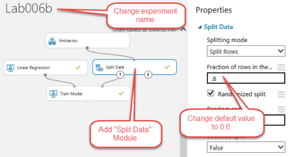  

4. Select the “Train Model” module and switch to its properties window then click on the “Launch column selector” button.  
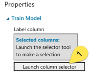  

5. In the pop-up window, select the ywnoise column as the label column then press the checkmark button on the bottom right corner.  
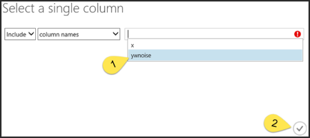  
For the simplicity, we have two columns, “x” and “ywnoise”, in our input dataset. There might be more columns as we will explore the case in the upcoming sessions. In this experiment, looking at the values in “x” column, we train our “Linear Regression” model with their labels/correspondence values on the “ywnoise” column. So the model will take any “x” value in the future and will predict the best possible “ywnoise” value. As summary, label column is the target column that we will predict its value.  

6. Drag&drop a “Score Model” module from “Machine Learning” -> “Score” node path. Make the appropriate connections as shown on the below screen shot.  
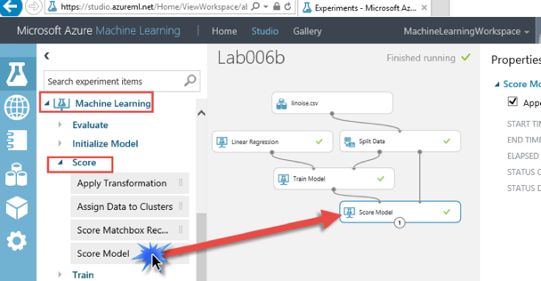  

5. “RUN” the experiment, then click on the output port of the “Score Model” module’s output port and click “Visualize” to view the output.  
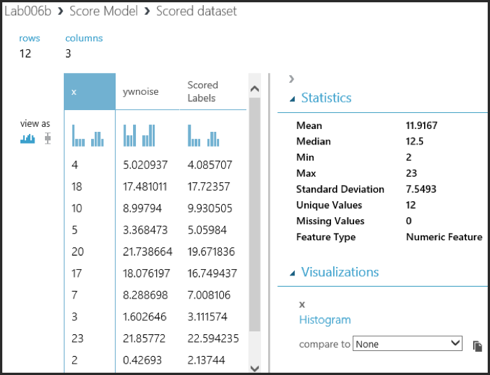  

6. You can see the Scored (predicted) labels appended as a new column to the result. You can see the original “ywnoise” column and the Scored labels which are similar to each other. Number of rows in the output dataset is equal to 12, which is %40 of 30 input rows split by “Split Data” module.  

7. Select the “ywnoise” column then go to the “Histogram” region on the visualization window. Select “Scored Labels” in the “compared to” combo-box.  
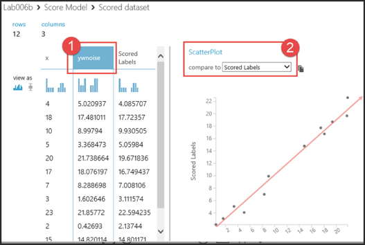  
You will see the scatter plot of “ywnoise” to “Scored Labels” which is linear as a line with slope equal to 1, which is the expected result.  

    We used %60 of the dataset to train our model and then used %40 of the other portion to evaluate the trained model. Result of the “Score Model” is still not very explanatory and requires manual interpretation.  

## 6.2.3. Evaluate a Regression model
Based on the experiment that is developed in the previous section, follow the below steps to evaluate the model’s performance.  
1. Drag&drop an “Evaluate Model” module from the “Machine Learning” -> “Evaluate” note path. Connect the output of the “Score Model” module to the first input port of the “Evaluate Model” module.  
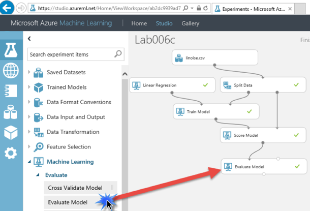  

2. “RUN” the experiment and click on the output port of the “Evaluate Model” module and finally visualize the output.  

3. The evaluation metrics available for regression models are (refer to image below):
    * Mean Absolute Error
    * Root Mean Absolute Error
    * Relative Absolute Error
    * Relative Squared Error
    * Coefficient of Determination  
    
    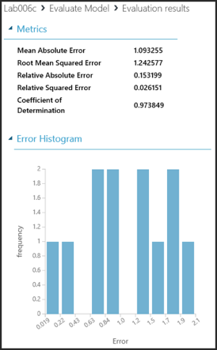  

    Lower error values mean the model is more accurate in making predictions. An overall error metric of 0 means that the model fits the data perfectly. Higher proportion of “Coefficient of Determination” is better, where 1 indicates a perfect fit.

    * Mean absolute error (MAE) measures how close the predictions are to the actual outcomes; thus, a lower score is better.
    * Root mean squared error (RMSE) creates a single value that summarizes the error in the model. By squaring the difference, the metric disregards the difference between over-prediction and under-prediction.
    * Relative absolute error (RAE) is the relative absolute difference between expected and actual values; relative because the mean difference is divided by the arithmetic mean.
    * Relative squared error (RSE) similarly normalizes the total squared error of the predicted values by dividing by the total squared error of the actual values.
    * Coefficient of determination, often referred to as R2, represents the predictive power of the model as a value between 0 and 1. Zero means the model is random (explains nothing); 1 means there is a perfect fit. However, caution should be used in interpreting R2 values, as low values can be entirely normal and high values can be suspect.  
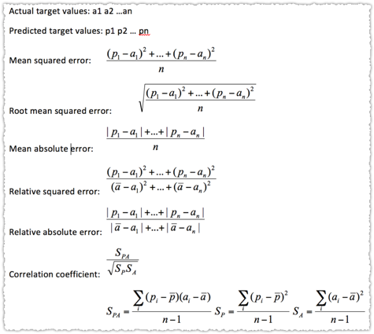  

### 6.2.4. Evaluate more than one model
What if we try more than one model over the same dataset? Which one is better?  
1. Create a copy of the previous experiment by “Save as” command.  

2. Press CTRL key and while holding CTRL key, select the modules one by one with a left mouse click. Select all the modules except the “linoise.csv”, “Linear Regression”, “Evaluate Model” modules.  Copy and Paste.

3. Place a “Decision Forest Regression” module in the second set, copied/pasted modules. Connect the output of the “Score Model” to the second input of the “Evaluate Model” module. Design the experiment as below.  
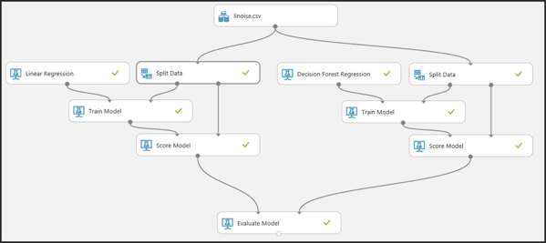  

4. “RUN” the experiment, visualize the output of the “Evaluate Model” module.  
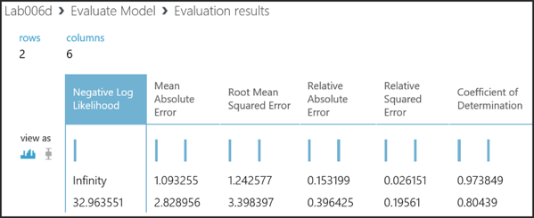  
sample metrics and basic evaluation:  
  
D best, C second-best, A-B arguable

## 6.2.5. Cross Validation
Cross-validation is a standard technique used in machine learning to assess both the variability of a dataset and the reliability of any model trained using that data. Cross validation randomly splits the training data into by default 10 partitions, or folds. Module begins with fold 1, sets aside the data in fold 1 to use for validation (called the holdout fold), and uses the remaining folds to train a model. Repeats this process for each fold.

1. Create a blank experiment, darg&drop a “linnoise.csv” data module, “Linear Regression” and “Cross Validate Model” modules. “Cross Validate Model” module is under the “Machine Learning” -> ”Evaluate” node path.  
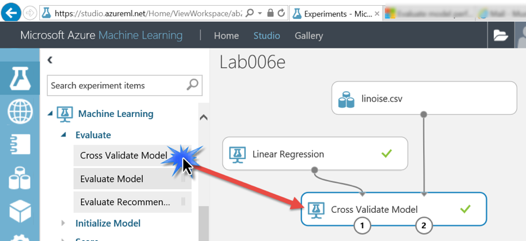  

2. Switch to the properties window of the “Cross Validate Model” module. Set the label column property to “ywnoise”.  
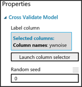  

3. “RUN” the experiment and visualize the first output port. You will see which row is assigned to which fold. As we have 30 rows in the input dataset, 3 rows distributed per fold.  
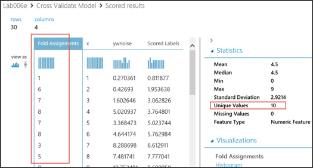  

4. Now visualize the second output port of the “Cross Validate Model” module. You will see the 10 evaluation result (one fold per evaluation). For each evaluation, you can explore the evaluation metrics. Each evaluation’s metrics seems to be similar.  
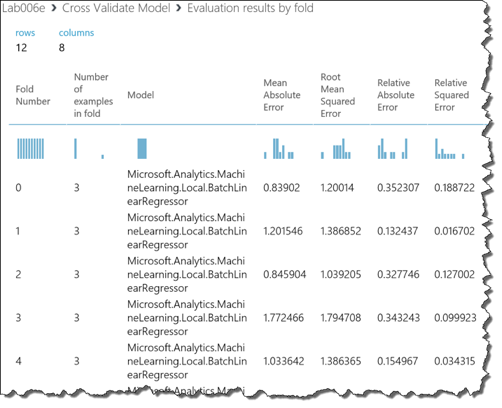  

5. Check the last two rows to not by observation but statistically to prove that the evaluation metric results are similar. i.e. Standard deviation of the “Coefficient of Determination” metric is very close to 0. Actually these mean and standard deviation values calculated over the 10 different execution with 10 different folds.   
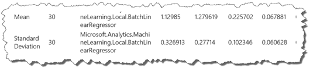  

## 6.3. Performance evaluation (cont.)
In the previous section we have worked on the performance metrics of an AML experiment which is a type of “Regression” model. So all the metrics mentioned above are specific for “Regression” models but generic for other model types. Following steps will give an overview about the performance evaluation metrics for “Binary classification” and “Multiclass classification”.  

### 6.3.1. Evaluate a Binary classification model
1. Create a blank experiment.  

2. Drop an “Adult census income binary classification dataset” module from “Saved Datasets” -> “Samples” node path.  
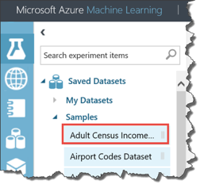  
Adult Census Income Binary Classification dataset is a subset of the 1994 Census database, using working adults over the age of 16 with an adjusted income index of > 100. Used to classify people by demographics to predict whether a person earns over 50K a year.  

3. Drop a “Two-class Logistic Regression” module from “Machine Learning” -> “Initialize Model” -> “Classification” node path.  
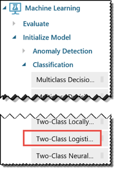  

4. Rest of the modules are same as the ones that we used in the previous sessions. Design the following experiment. Set “Fraction of rows…” property of the split module to 0.8. “Label Column” property of the “Train Model” module to “income”. If you visualize the dataset and check the statistics on the “income” column, you will see that it holds two unique string values either “>50K” or “<=50K”  
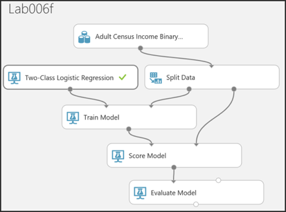  

5. “RUN” the experiment and visualize the output port of the “Evaluate Model” module. Scroll down to the numeric metrics such as:  
    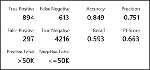  

    Using the evaluation dataset, trained model is evaluated. This time the parameters are different and specific to “Binary classification”. Result of the evaluation is ended with 4 key parameters: True Positive(TP), False Negative (FN), False Positive (FP), True Negative(TN). Here i.e. TP is the number of positive predictions calculated by the trained model for the positive labels. Sometimes trained model can score a positive label as false, which is the FN case. Same approach for FP and TN as their names implies. Using these parameters, we can construct the confusion matrix:  
    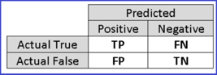  

    Based on confusion matrix; Recall, Accuracy, Precision like other statistical metrics generated. In this report, first metric to analyze is the “Accuracy (ACC)” which is simply the proportion of correctly classified instances (model with ACC=1 is more accurate than model with ACC=0.1), but most of the time without other metrics, it may not give true insight. Assume 99% of your training data is labeled as true and your model just predicts any input as true. In this case accuracy of such model will be %99 which is not true. So homogenous input data is also one of the several other metrics.  
    
    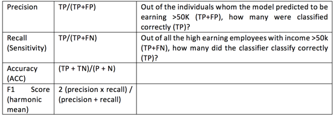  

    Answer to “Which is positive or negative label? ‘>50K’ or ‘<=50K’?” is also found in this region of the evaluation report. If the class labels are Boolean or integers, then the ‘true’ or ‘1’ labeled instances are assigned the positive class. If the labels are strings, as in the case of the income dataset, the labels are sorted alphabetically and the first level is chosen to be the negative class while the second level is the positive class. So in our case positive label is “>50K”.  

    Regarding the ROC curve in the evaluation metrics, which is a graphical metric, higher the area under the curve means a better model. So a curve that is closer to the top left corner indicates a better model. For more details on ROC curve or AUC parameters refer to the video tutorial.  

6. Looking back to confusion matrix, sum of all actual True’s and False’s must same to the number of rows in “evaluation dataset” but above it is not the case. Going back to our original dataset, visualize, check each column to see if there is a missing value. For example, “native-country” column have 583 missing values.  
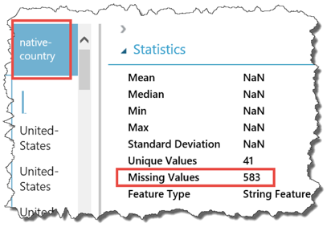  

7. Drag&drop a “Clean Missing Data” module from “Data Transformation”->”Manipulation” nodepath. Keep its default values as it is (where it will replace missing values in all columns with 0)  
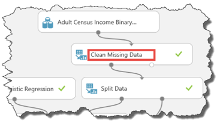  

8. “RUN” the experiment again and re-evaluate the confusion matrix to see the effect of filtering or updating missing value rows in the training dataset.  

### 6.3.2. Comparing two binary classification model
1. Clone the previous experiment.  

2. Copy/paste the two module (Train Model, Score Model) within the same experiment.  

3. Drag&drop a “Two class boosted decision tree” module as an input to the “Train Model” module.  

4. Make the appropriate connections as below:  
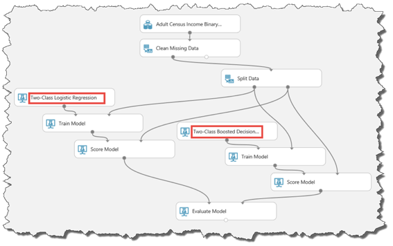  

5. “RUN” the experiment and visualize the “Evaluate Model” module output. You can compare two model with the ROC curve.  
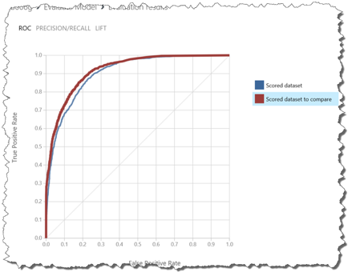  

6. Visualize train model output of both models. Change parameters to see how it affects the output. For Boosted Tree model, you can browse between the generated trees, each node’s effect on the decision. Similarly, you can do the same for Logistic Regression Classifier which has different training properties.  
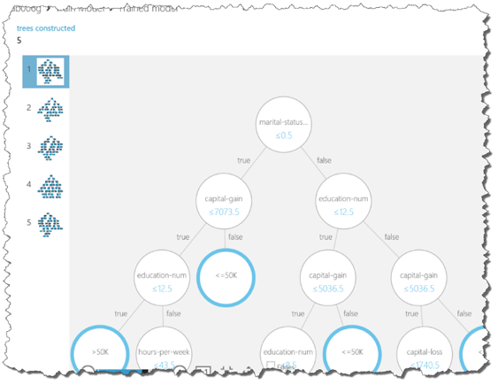  
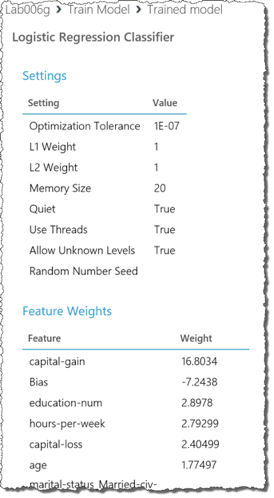  

### 6.3.3. Cross Validation on Binary Classification
Cross Validation module works with similar approach as in the basic linear regression model. Only the output metrics changes. You will see the Accuracy, Recall like metrics for each fold in the validation process.  
1. Based on the knowledge from previous experiments, build the following experiment and visualize the second output port.  
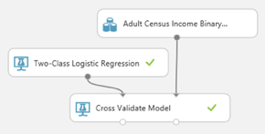  
Visualizing the second output port of the Cross Validate Model module will list the evaluation results per fold and their mean and standard deviation values.  

2. Connect a “Convert to CSV” module to the second output port. Download the CSV result and open it in Microsoft Excel or another spreadsheet viewer.  
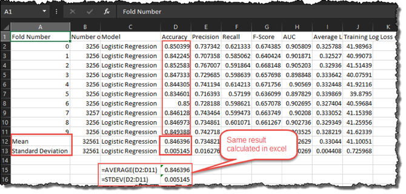  
You can make custom visualization or additional analyzes over the evaluation results in excel too.  

### 6.3.4. Evaluating a Multi-class classification model
In this section we will use a dataset that is available on Internet from the address: http://archive.ics.uci.edu/ml/machine-learning-databases/iris/iris.data This dataset contains information about Iris plant. More details about dataset can be found at: http://archive.ics.uci.edu/ml/machine-learning-databases/iris/iris.names. Around 150 measurements made for 3 different types of Iris plant. Each record in the dataset contains following 4 features and a label (class):  

1. sepal length in cm
2. sepal width in cm
3. petal length in cm
4. petal width in cm
5. class: 
    * Iris Setosa
    * Iris Versicolour
    * Iris Virginica

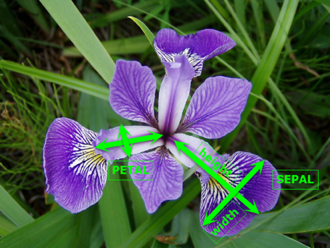  

Because there are more than one class in this dataset, we will use “Multi-Class classification” method to create an ML model. Having first 4 feature (measurement) of an iris plant, our trained model will be able to classify in which of the 3 classes the plant belongs to.  
1. Create a blank experiment.

2. Drop an “Reader” module from “Data Input and Output” node path.  

3. Select the “Reader” module and made the following changes on its properties. Use the value “http://archive.ics.uci.edu/ml/machine-learning-databases/iris/iris.data” (without quotes) as URL property.  
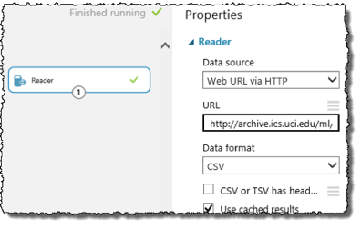  

4. Create the below experiment and set “Split Data” modules “Fraction of Rows…” property to 0.8. Set the “Label Column” property of “Train Model” module to “Col5”.  
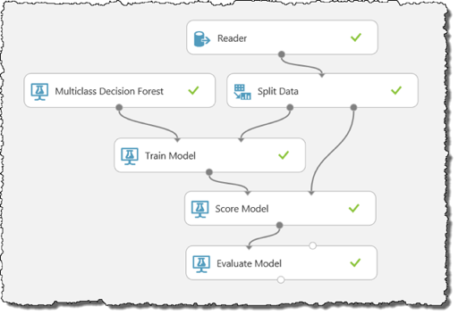  

5. “RUN” the experiment and visualize the “Evaluate Model” module’s output port.  
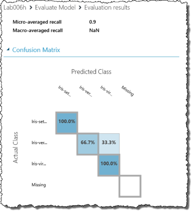  
As we have 3 unique label values, evaluation result will consist of 3 by 3 matrix (excluding the missing values which exist in the input dataset). This matrix shows that %100 of the “Iris Setosa” and “Iris Virginica” labeled data instances were correctly predicted. On the other hand, while %66.7 of “Iris Versicolour” labeled instances correctly scored, %33.3 of them scored as “Iris Virginica”.  

6. Change split module’s “Fraction…” parameter, use different type of multiclass classification algorithm under “Machine Learning”->”Initialize Model”->”Classification” node path to see how the evaluation result changes, their impact on the result.  

## 6.4. Feature engineering
In this section we will focus on the importance of features in a dataset. Referring to our first experiment in Lab002, we generated 30 rows of data with a single feature (x) and a single label (ywnoise). Now we will add second feature (z1) which is a clone of “x”. Below you can see the dataset and its plot on 3D x, y, z coordinate system.  
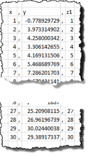
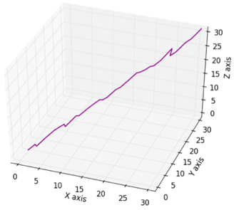  

1. Let’s evaluate our model with and without z1 column. Start by building the same first linear regression experiment that we did in Lab004 and made some smaller changes on the model (see below image for final experiment schema).  
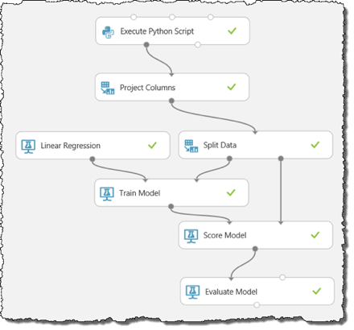  

2. Add the following code in the “Execute Python Script” module. This code will create the new column “z1” that is the clone of “x”, z2 with random numbers that ranges between -10 and 10, and another column “z3” with fixed value 5.  
    ```python
    import numpy as np
    import pandas as pd
     
    def azureml_main(dataframe1 = None, dataframe2 = None):
        x = range(1, 31)
        y = x + np.random.uniform(-3, 3, 30)
        z1 = x
        z2 = np.random.uniform(-10, 10, 30)
        z3 = [5] * 30
        
        d = {"x" : x, "y" : y, "z1" : z1, "z2" : z2, "z3" : z3}
        df = pd.DataFrame(d)
        return(df)
    ```

3. Use “Project Columns” module to filter out features “z2” and “z3” as:  
  

4. After running the experiment, visualize the output port of the “Evaluate Model” module.  
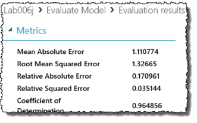  

5. Now filter out “z1” also and visualize the output port of the “Evaluate Model” module. No need to put the screenshot because the result is same. So with or without adding “z1” as a new feature to the training, it doesn’t have any effect on the result.  

6. Do the same evaluation by adding only “x”, “y” and “z3” and you will see again there is no difference.  

7. Now do it again by adding only “x”, “y” and “z2” columns. Now the evaluation metrics changed. Still the scored values are close to the expected values (visualize the “Score Model” module’s output to see the predictions) But error in the evaluation metrics grows, because we added random noise.  

### 6.4.1. Which feature is or is not important? 
Not always but having more features will increase the precision but also increases the complexity, memory requirement and computation speed etc. So it is important to filter out redundant, useless features.  

1. Visualize the output port of the “Project Columns” module. Select column “x” and then select “z1” in the “compare to” combo-box under “Visualizations” section.  
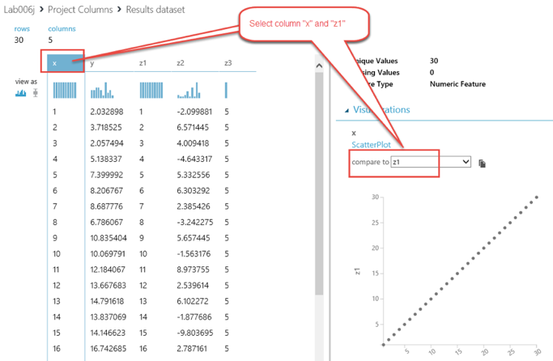  

2. Do the same for comparing column “x” to “z2”, “x” to “z3”, “z1” to “z2, “z2” to “z3” and “z1” to “z3”. Compare the resulting “ScatterPlots” of all.  

    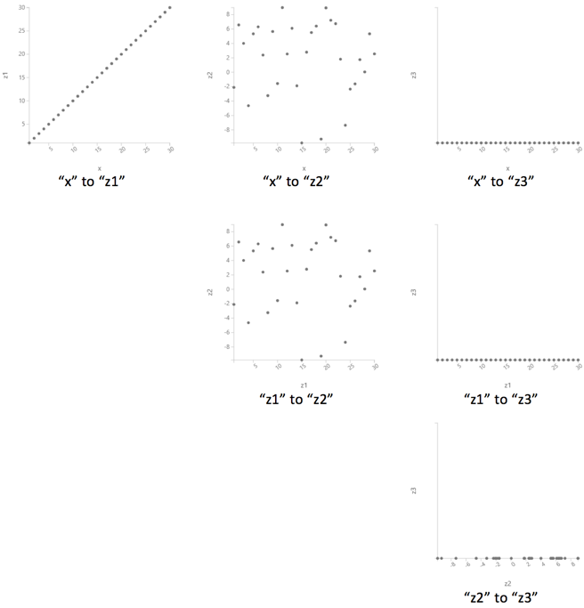  

    This will show you the relation between “x” and all other columns. i.e. While there is a linear relation between “x” and “z1”, there is no clear relation between “x” and “z2”.  Generally, it is expected for feature values to have no linear relation between them, so scattered plots with linear patterns are not well.  

    Do we need to compare all features in the ML studio? What about if we have 100 features (means 100*100 comparisons)? There is an easy way to do all which is described in the next steps.  

3. You can use the following python script and use “scatter_matrix” to visualize all comparisons and event visualize each feature columns histogram to see if the data homogenously distributed.  
    ```python
    import matplotlib   
    matplotlib.use('agg')   
        
    import matplotlib.pyplot as plt 
    from pandas.tools.plotting import scatter_matrix   
     
    def azureml_main(dataframe1 = None, dataframe2 = None):
        fig1 = plt.figure(1, figsize = (12,9))   
        ax = fig1.gca()   
        scatter_matrix(dataframe1, alpha=0.2, figsize=(10, 10), diagonal='hist', ax=ax)   
        fig1.savefig('scatter.png')
    
        return dataframe1,
    ```

4. Build the following experiment by adding the above script into the second “Execute Python Script” module. “RUN” the experiment and visualize the second output port (device port) of the “Execute Python Script” module.  
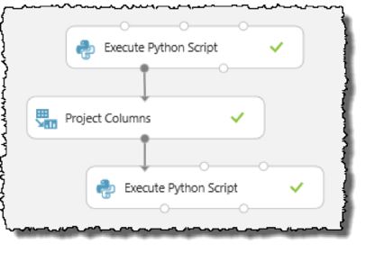  
Visualization will be something similar to:  
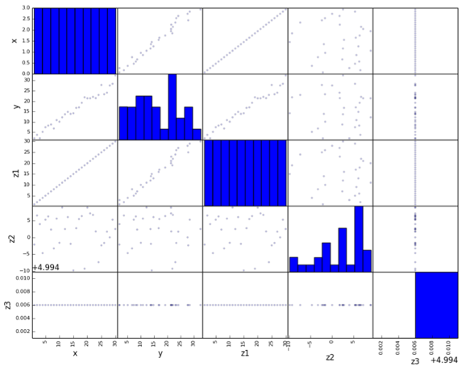  
From the above matrix it is clear that “z3” doesn’t have big impact as it is linear (constant). Also same for “x” and “z1” as they are linearly dependent and very similar, we may omit one of them etc.  

### 6.4.2. Simpler method to measure a feature’s importance
1. Update the experiment by adding “Permutation Feature Importance” module with following connections.  
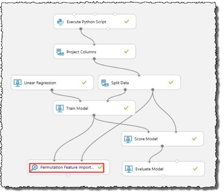  

2. As we are using a regression model, select one of the “Regression” metric that you want to measure its performance against each feature in the dataset.  
“Metric for measuring performance”  
  

3. “RUN” the experiment and visualize the output of the “Permutation Feature Importance” module.  
  

    You can see that “z3” has 0 effect on the result and “z2” doesn’t have so much impact while “x” and “z1” have higher impacts.  
