# Azure ML Batch Score, Retrain, Production and Automatization
## 7.1. Overview
We explored the ways to develop experiments, publish production models as web services and test with request response (RRS) scenarious. In this section we will go beyond the simple RR scenarios and mention about the importance of retraining our model, how to put the generated model into production mode and batch scoring (BES) options.  

### 7.1.1. Objectives
This lab is about:
* Importance of retraining
* Batch and Request Response scoring
* Retrianing a model programmatically or automaticaly
* Update existing model in production with the retrained one
* RRS & BES Web Application Templates

### 7.1.2. Requirements
- Basic Azure ML knowledge on developing experiments

## 7.2. Importance of Retraining, seeing the whole picture
In the early lab sessions we generated a synthetic data with 30 data samples. When we plotted these 30 data samples in 2D space, we observed that the samples (points) lays nearly on a line which we formulated as f(x) = y (a line equation with slope 1 and intercept 0, which is y = mx+n). These samples (points), in ML context called features with labels, plotted on a canvas (see below image with green area). With only 30 samples, we assumed that it seems to be laying on a line so we used linear regression model in our experiment.

What if we had a bigger picture of the samples (not only more samples but samples distributed around larger space)? i.e. having 6 samples (x is the only feature, y is the label):

|  x  |  y  |
| --- | --- |
|  0  |  0  |
| 10  | 10  |
| 20  | 20  |
| 30  | 30  |
| 100 | 80  |
| 200 | 85  |

When we plot the above samples, it seems to be that it lies on a 2nd order polynomial or simply, it is not linear (see the below image with blue dots).  
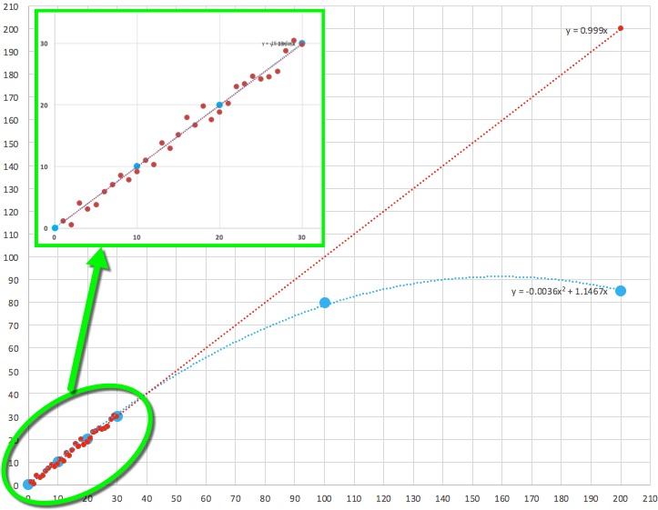  

Or instead of 2nd order polynomial, if we represent these 6 samples with 5th or 6th order polynomial, it might look like as in the below image and behave completely different than the initial model.  
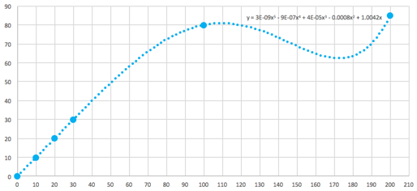  

To summarize, it is important: to see the whole picture, have big enough samples distributed over larger area and use the right ML model.  

Going back to the initial synthetic data, which we assume the only data we have at the time of the modeling, we trained our model and created a prediction model. After some time, assume that we received - observed more samples with true labels and it becomes clear that the samples are not linear as in the plot above. In such case, where we have more observations - samples over time, we have to retrain our model to make better predictions. Azure ML lets us to implement this scenario with retraining functionality which we will explore more in the next lab sections. 

##7.3. Batch and Request/Response scoring web services
Once you have a trained model, there exist two options to use this model to score/predict the unknow labels of any data. Either each data row can be scored one by one (in our sample above, predict the label **y** of each **x** one by one) and labels for each sample received immediately per request or you send a batch data (set of x values in single request) and this request queed at AzureML end, computed and the whole result retreived when the computation completed. During this computation period you check the service with regular calls to see if the result is ready to retrive or not.

### 7.3.1 Stages to create a scoring web service
To use the trained model in a production environment, developed solution needs to be published as a webservice. To publish a scoring webservice, in order we create a **training experiment**, deploy a **predictive experiment** out of the training experiment, deploy a **scoring web service** out of this predictive experiment. By default scoring web service's *default* endpoint will have two methods: **Request/Response** and **Batch Execution** methods. Later we will manually add one another endpoint for updating the existing trained model module. This new, manually added, endpoint will have three methods by default. If you retrain the your model and replace the existing "trained model" module with the new trained one (by using update method of the new endpoint), be carefull to use the right endpoint. Old (default) endpoint will be attached to the old, initial, trained model so if you continue using that endpoint it will not reflect the changes. So once you retrain the "trained model" with new observations by the endpoint's "update method", you should use the same endpoint for scoring. For generating new "trained model" modules with the new observations, we also manually add **new web service** to the *training experiment*.  
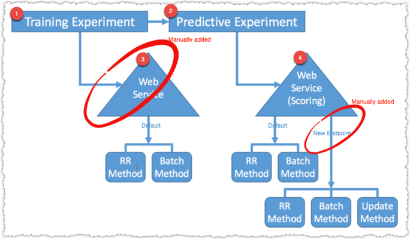  

#### 7.3.1.1. Request/Response Service (RRS)
Actually we completed the Request Response Scoring (deploying web service) session in the previous lab. In this lab session we will try to go in more details. RRS is used to make real-time calls where we need immediate response per request. It works as sending features in Json format to the web service input, then the corresponing label is retreived from the web service output.

Reminding our simplest training model that we developed in the early lab sessions, we had the following workflow:  
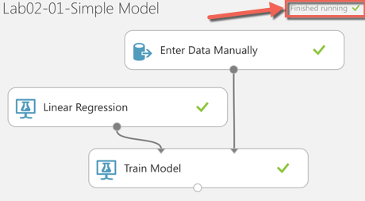  

1. Once you complete the development of **training experiment** (which we did as in the above screenshot), click on the "RUN" button to execute the workflow and see each module executed successfuly.  
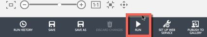  

    Once the execution complete, you will see the notification "Finished Running" on the right top corner of the experiment canvas. Now you can create a "Predictive Web Service" with a default endpoint. 

1. Click on the "Set Up Web Service" button on the buttom of the screen and then click on "Predictive Web Service [Recommended]" in the popup menu.  
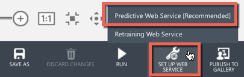  

    This action will create a new experiment that is called **Predictive Experiment** mentioned above and will be shown as a seperate tab on its linked **Training Experiment** canvas (see below image). Also note that it is in "draft" mode initially.  
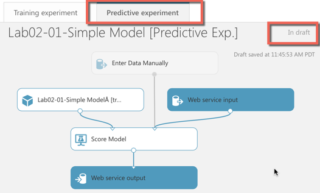  

    By default Web Service input and output modules placed. When we access this **Predictive Experiment** through a web service, these webservice i/o ports will be used instead of the default datasource module **(which is shown as disabled on the canvas)**. If you want to change the names of these i/o ports in the Json payload of the webservice, just click the module and change names in the properties window.

    Also note that instead of Linear Regression module, now there is another module placed in the **Predictive Experiment** (see below).  
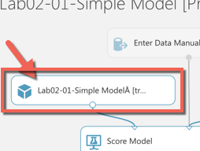  

    This new module called "Trained Model" module and will be used in the web service to score new data (it will not be retrained each time a call made)

1. To see all existing trained model modules, Click on the Trained models tab.  
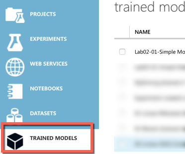  

1. To create a webservice out of the above **Predictive Experiment**, again "RUN" the experiment and see the "Finished Running" notification on the top right corner. Then you will be able to see the "Deploy Web Service" button activated.  
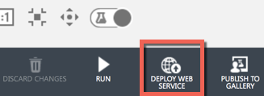  

1. Click on the "Deploy Web Service" button to create default webservice endpoint of the **Predictive Experiment**. Once finished, it will open the dashboard of the web service which you can also access from the "Web Services" page in the AML Studio (see below):  
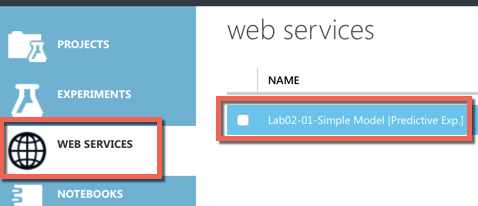  

    On this dashboard, you will see the **API Key** to access the webservice endpoint and two methods (Request/Response and BatchExecution) of the endpoint.  
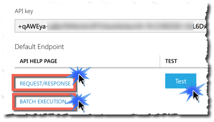  

1. Click on the Request/Response link to open the RRS method dashboard and see the sample test code to make RR webservice calls, I/O parameters, parameter data types, URI address etc.

#### 7.3.1.2. Batch Execution Service (BES)
In case you have a large amount of data (rows of features) and want to score each rows of features to predict their labels in a single call, you can use the Batch execution method of the scoring web service endpoint. Execution pattern of the BES is different than the RRS. It creates a queued job, processes it, during the process it gives a job status notification service (i.e. job still running or finished) and returns the scored output once the job completed.

To access BES, you need the same API key that was used in RRS and the BES specific method URI of the endpoint. You can click on the "Batch Execution" link (shown on the above screenshot) to open the BES method dashboard to get the URI and sample codes to use the service.

In the sample training model mentioned above we used a dataset with **x**  values from 1 to 30 and their corresponding **y** values for training. After training our model with this initial data, we published as web service and tested the RRS method of the endpoint. Now assume that we have a big amount of feature data rows as below (sure in real case it is much more than this)

|  x   |
| ---  |
|  50  |
| -10  |
| -200 |
| 97   |

we want to score them and predict/score corresponding **y** values in batch.

|  x   |  y  |
| ---  | --- |
|  50  | ? |
| -10  | ? |
| -200 | ? |
| 97   | ? |  

Batch processing will proceed in three steps:
    - Submit a batch scoring job
    - Start the job
    - Check the batch job status (finished or running etc.)
    - if finished, get the result. if not, check again the status.

1. Generate sample data. Create a CSV file with the contents mentioned above (just **x** values, we will predict the **y** ones). Name the file "input1data.csv" and save it under a local storage folder i.e. **c:\temp\input1data.csv**  
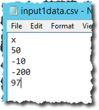  

1. Create or use exsiting Azure Storage Account. Under this account create or use existing container. (Same operations already discribed in the earlier lab sessions by using Azure Storage Explorer application.) Do not copy the local input file into this container, it will be done automatically by the sample application programmatically. This storage area will be used to store input, output data and trained model module etc.  
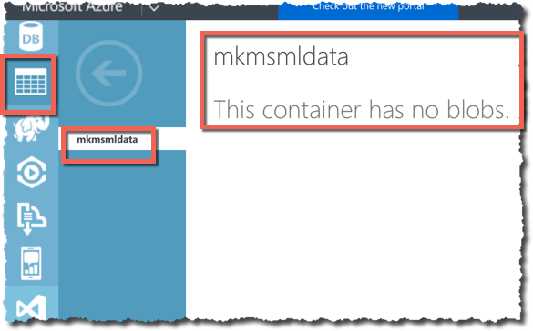  

1. In Azure ML Studio, goto the Web Services page. Click on the "....[Predictive Exp.]" web service that we created from the "predictive experiment".  
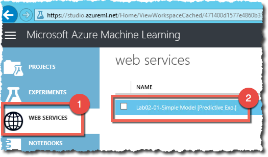  

1. Click on the **Batch Execution** link on the **Dashboard** page that is opened by the previous step.
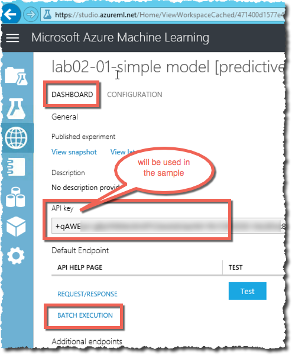  

1. Previous step will open a new page named **Batch Execution API Documentation for...** scroll to the bottom of this page where you will see the sample codes.

1. Under **c#** tab, select the code and copy it. We will use this code in a **Console Application** that we will create in Visual Studio.  
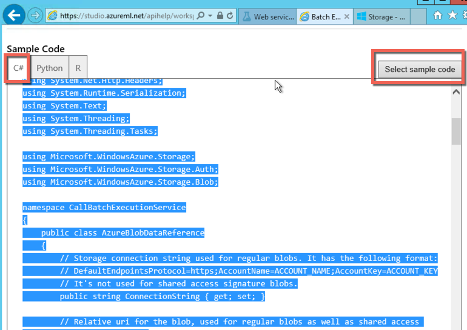  

1. Open Visual Studio, create an empty C# console application from the existing templates.
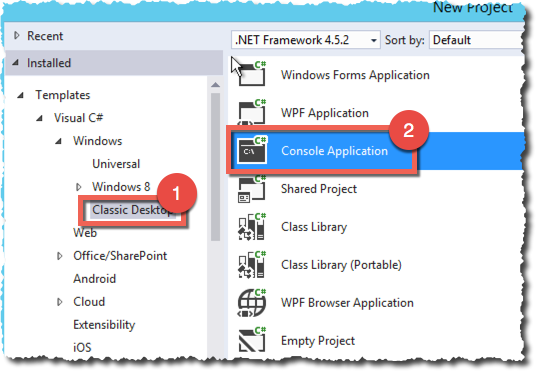  

1. Delete the contents of the program.cs file and **paste** the sample code that is **copied** in the previous step.
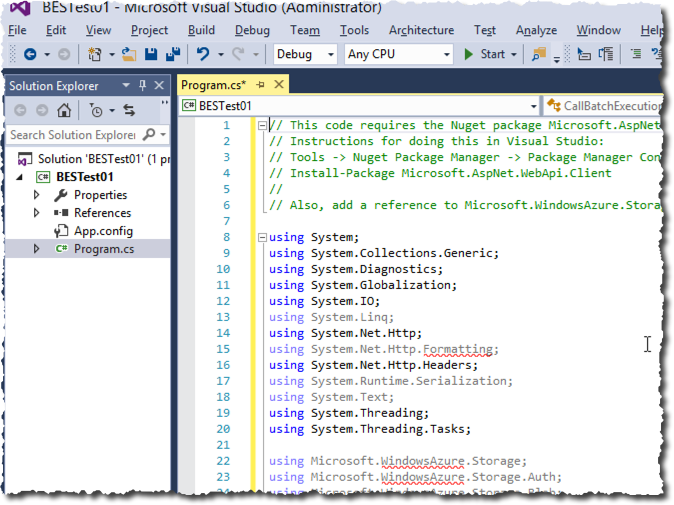  

1. Install the missing Nuget packages that are mentioned in the header comments of the program.cs file.

1. Find the method named "InvokeBatchExecutionService()" in the program.cs file and update the marked variables below.
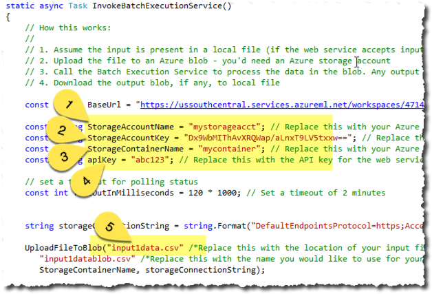  

    For the variables 1 and 2, copy/paste the correct values from the storage account dashboard that you can find on Azure Portal.
    
    For the 3rd variable, type the container name that you created (i.e. mkmsmldata that we used in one of the screenshots above)
    
    For the 4th variable copy/paste the API key value that you can find on the web service dashboard where we clicked on the "Batch Execution" link.
    
    Finally update the 5th variable to point the exact stored location of your local file. i.e. "C:/temp/input1data.csv"  
    
 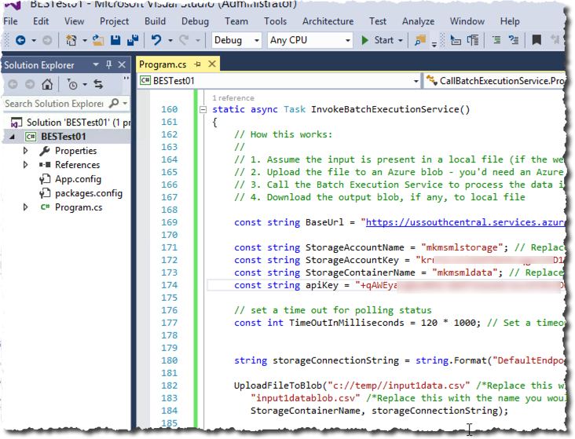  

1. Run the program. It will upload the local input file to the storage container, post a BES job, run the BES job, will wait the job to be completed by checking job status in a loop. Once the job status become **finished**, will print out the output file location (which is the same location as the input file).
 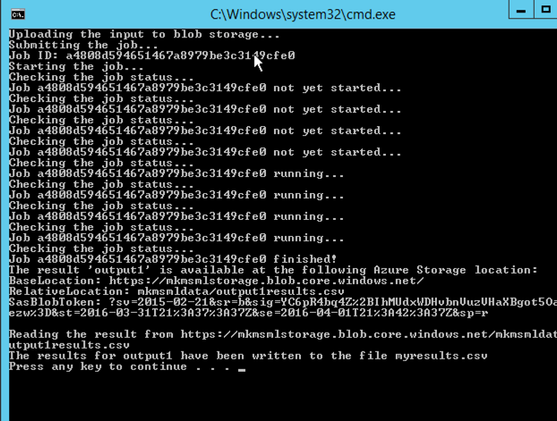  

1. Either with the Azure portal or the Azure Storage Explorer tool or another tool, access the container and download the output file **output1results.csv**.  
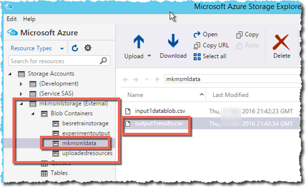  

1. Open the downloaded file in Excel or notepad. You will see the corresponding scored/predicted values all in the file.  
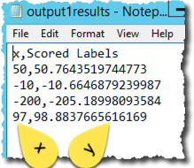  

    As you can see the corresponding value for **x=200** is **205** which is very close to **200** (because of noise that we used in initial training). 
    
    What if the data is not linear (red dots in the below image) but polynomial (blue dots on the below image)? Then for the feature **x=200** the corresponding **y** value should be approximately equal to **85!**  
   
 
    With the initial training dataset (30 rows of lines) it is assumed that the data is linear (see zoom-in image below, left top corner). Once we have more samples distributed over the wider space, we can retrain our existing model to have reliable/better scoring (see the next lab sections for retraining with new data observations). Automating this operation is useful in case of live projects where data, new observations, flow into the system regularly.

#### 7.3.1.3 Web Service Input/Output Parameter alternatives 
It is not always the case to provide data as a webservice input parameter to the **Predictive Experiment** also not always the case to retreive the scored data from the webservice output endpoint. You can delete, "Web Service Input" and "Web Service Output" parameters (but keeping the webservice) from the experiment and put a reader, writer like data modules. At the end, once published again or updating the existing, we will have a webservice without any i/o endpoints. So when the RRS or BES web service is called, the input data is read from the provided module and the output is written to the specified data module. I.e. For batch processing, you can put all data rows in Azure Blob storage, set the **predictive experiment** to read data from the Azure blob storage through a reader module. Also you can drop a writer module to write the scored/labeled rows into an Azure SQL server database once execution complete.

## 7.4 Azure ML Retraining
Referring to the scattered data plot (previous screenshot), assume that we trained the initial model with the data observations in the range **0 < x < 30**. With this training, our model behaves linearly (as red dots). But after some time we received more samples/observations in a wider space with true labels such as (blue dots):

|  x  |  ywnoise  |
| --- | --- |
| 80  |  68  |
| 90  | 74  |
| 100 | 80  |
| 140 | 90 |
| 160 | 92 |
| 180 | 90 |
| 200 | 85  |
We can re-run the training experiment, re-publish (update) the predictive experiment. So it will be retrained and reflects the new data contribution. But if we do it over and over for each new data observations, it is not an efficient way and we need to make it programatic. so we can call a script/program or even Azure Data Factory to update our model with the new one automatically and periodically.

   Actually, steps to retrain the model is:
    - Create a web service on top of the training experiment (not the predictive one). We will use this web service to generate new "Trained model (ILearnerDotNet)" modules.
    - To create new "trained model" module with new observations, use the BES endpoint of the web service created in the previous step (because we will provide new observations as a batch data in single method call).
    - Output of the previous steps (which is a new TrainedModel) will be written into the same storage area as the experiment (we will configure it in the next stages of this lab section)
    - Now we will switch to the web service of the "Predictive Experiment" (not the training experiment). But this time we will open the web service dashboard in the Azure "Classic Portal" not in the Azure ML Studio.
    - In the classic portal we will add a new endpoint (will not use the default one) to the webservice. We are not using the default endpoint as it is hard linked to the initial training model.
    - This new webservice endpoint will have three methods: RRS, BES and a new method type "Update"
    - We will use the update method of this new endpoint to update the trained model with the new one that is created in the second step. 
    - Once it is updated, we can use the RRS and BES methods of this new endpoint (which is linked to the updated model) for scoring.  

  

Followind the above steps, lets retrain the existing model with the above new observations (data).

1. Open the training experiment (not the predictive one).

1. Add one Web Service Input and one Output modules and make the appropriate connections as in the below image:  
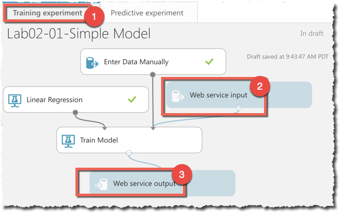  
    "Web service Input" is used to provide new observations (data) as input. "Web service Output" is used to output the new trained model. 
    
1. Quick note: when you provide new observations as an input to retrain the model, you should provide accumulated, all data (together with historical, old observations!) 

1. Quick note: if you move the mouse cursor over the output port of the "Train Model" module, you see the output data type of this module as:  

    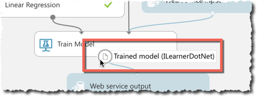  

    You can see that the output of this module is "Trained model (ILearnerDotNet)"

1. "Run" the experiment.  

1. Now "Set up web service" button is active. Click on the "Set up web service" button and click on the "Deploy Web Service" item on the popup menu.  
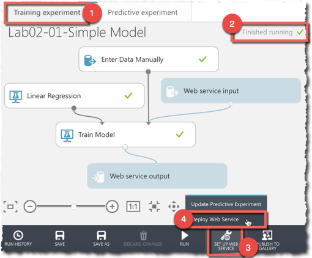  

1. If you goto the "Webservices" page in the ML Studio, you will see the newly created web service. **Note** the API key of this webservice's default endpoint and the URI of the BES method. We will use these, call it **first triplet**, in the upcoming stages.  
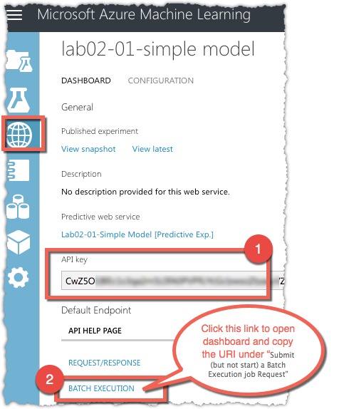  

1. To access the Batch URI, click on the "Batch execution" link that is shown in the previous step. You will see the URI under "Submit (but not start) a Batch Execution job" section. It is the URI that we will use in the **first triplet**  
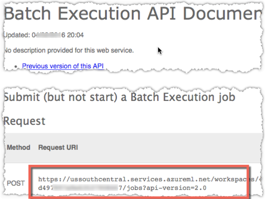  

1. Also scroll down to the end of the this page where you will see the sample code. Copy the C# code as a part of the **first triplet** parameters.  
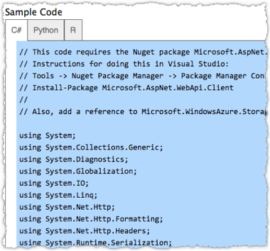  

1. We complete the steps to collect parameters required to generate updated models. Later we will use the above **first triplet** (ApiKey, URI and C# code) in the sample retraining application together with other parameters after completing the next stages.

1. Now switch to the "Machine learning" service in the classic Azure Portal.  
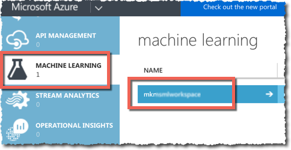  

1. Click on the ML Workspace that you are working on.

1. Open the Web Services tab.  
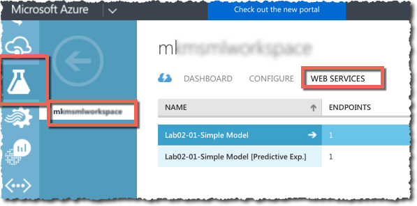  
You will see the two webservices that we created in the Azure ML Studio. You can see that one endpoint per webservice exist (see Endpoints column). These endpoints (called default endpoints) created by default with two methods: RR and BES methods.

    Now we will create additional endpoint which is not possible to be done under Azure ML Studio. That is the reason we switched to the Classic portal.
    
    We are not using the default endpoint of the scoring web service as it is hard linked to the initial trained model. We want to create another endpoint which will be always pointing to the retrained, updated model.
    
1. Click on the "...[Predictive Exp.]" web service.  
  

1. Here you will see the default endpoint. Click on the "Add Endpoint" button on the footer bar to add a new endpoint.
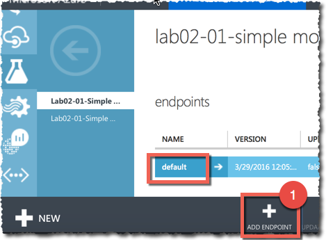  

1. Give any name to the new endpoint and keep other parameters as they are.  
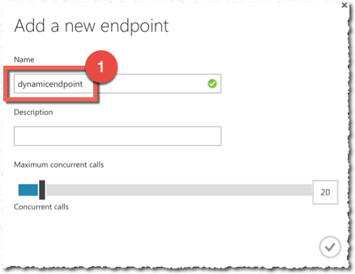  

1. Click on the new endpoint name to open its dashboard which looks like:  
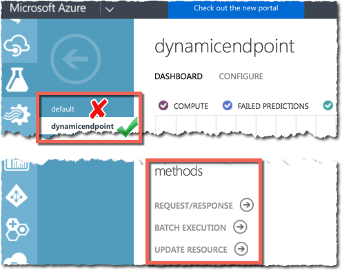  

1. Scroll down on the dashboard page, where you will find the "API Key" parameter.  
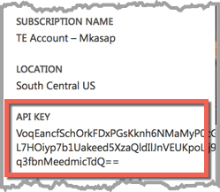  

    Note the API Key. This key is different then the one that we previously noted as a **first triplet** in the previous steps. This new API key is used together with the three new methods: Request/response, Batch Exec., Update Resource.
    
1. Click on the Batch Execution link and **note** the BatchExecution URI together with the above API key as **second triplet**. Also copy the C# code at the end of this page as part of the **second triplet** that we will refer later.  
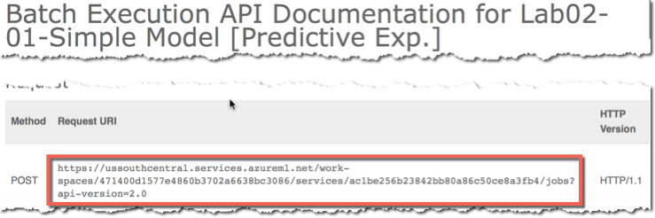  

1. Go back, now click on the "Update Resouce" link and note the Update URI together with the above API key as **third triplet**. Also copy the C# code at the end of this page as part of the **third triplet** that we will refer later.
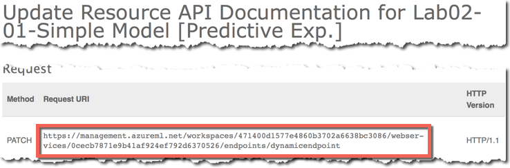  

1. Now we have three set of triplets (URI, APIKey and C# code). We will create three different C# console applications and will use each triplet per console application. We will name the three console application as: 1) TrainedModelGenerator, 2) Updater and 3) BatchScoreTest. In addition to these three set of triplets, we need the account name, account key and a container name of the Azure storage account. (refer to the previous labs for how to get these storage parameters)

1. Open visual studio, create a blank Console application. Name it **TrainedModelGenerator**. Delete everything inside the program.cs file and Copy/paste the sample code from the **first triplet** that we generated in the above steps.

1. Update program.cs file of the **TrainedModelGenerator** project with the values in **first triplet** and storage account parameters.  
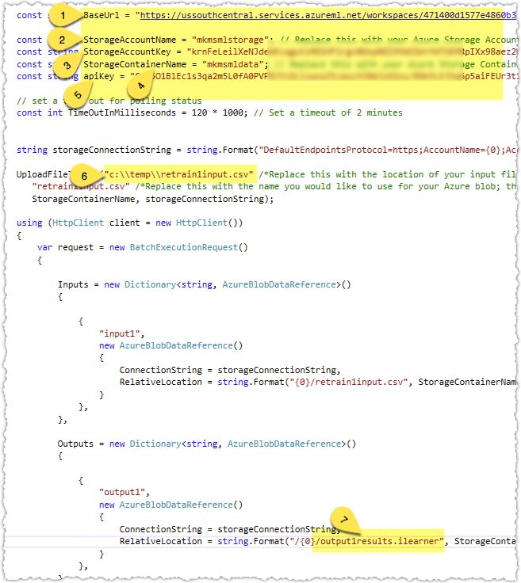

    - 1) BaseUrl: no need to update. It must be same as the URI in the **first triplet**  
    - 2,3,4) update with your Azure storage account parameters. You can use any container.
    - 5) apiKey: update with the API Key in **first triplet**
    - 6) use the exact path of the local data file (new observations, together with the old ones). Header row of the file must be same as the initial training data (x and ywnoise).
    - 7) output file name extension must be ".ilearner" as in the above example. in the second console app (named "Updater"), !!!Must use this file name!!!.
     
1. Run the application (CTRL + F5). After completing the execution, it will output important parameters that we will use in the next console application named "updater". This parameters are valid for 1.5 hour. If you need them after this time period, you need to regenerate them by re-running this app.
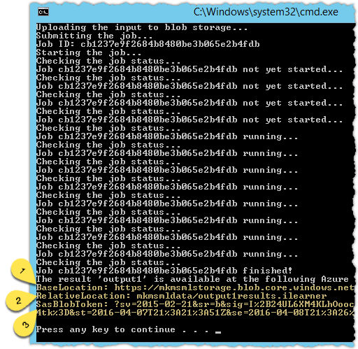  
    
    from the first console app output (above) **note** the parameters 1) "BaseLocation", 2) "RelativeLocation" and 3) "SasBlobToken" to be used in the next project named "updater".

    Above step will generate a new "trained model" as a file named "output1results.ilearner" in the storage area that we specified. Now lets use this output file to attach to the new endpoint of the scoring webservice.

1. Open visual studio, create a blank Console application. Name it **Updater**. Delete everything inside the program.cs file and Copy/paste the sample code from the **second triplet** that we generated in the previous steps.  

1. Update program.cs file of the **Updater** project with the values in **second triplet** and the outputs from first console application above.  
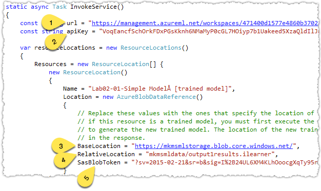  

    - 1) url: no need to update. It must be same as the URI in the **second triplet**.
    - 2) apiKey: replace with the Api key in **second triplet**.
    - 3,4,5) Update with the values in the first console application's output above.

1. Run the second console application "updater" with CTRL+F5. There will be an empty output as below.
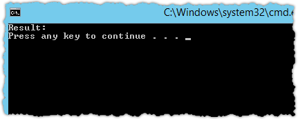  

1. Now we retrained our model and it is ready to be used. As we did in the early sections of this lab, now using the **third triplet** create a new console app for batch scoring. Please refer to early BES console app to complete this step. It is completely same except using the new parameters and new set of test data.

1. i.e. we will use the following sample input test features to get their scores with BES method ove the new web service.  
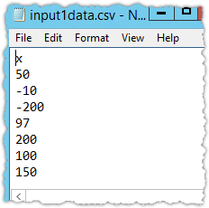  

1. Result will look something like below. Which is closer to the expected values. If you use more samples with true labels in the retraining stage, scoring will become better. As you can see, the result is not linear anymore and the model behaves like polynomoal.  
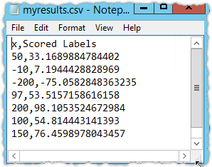  
