# 10. Case Study: Optical character recognition

## 10.1. Overview
In this lab, we will develop an end to end solution with cloud backend. This lab is suitable for half day training depending on the level of users' ML knowledge. Based on an OpenSource dataset, we will develope a digit recognition Azure ML solution, publish it as web service, connect with Azure Management API to manage the usage rate, overcome CORS and security issues, and integrate into a simple Azure Web application to draw our own characters on a web page canvas and retrieve the ML prediction about the character. In this lab we will use the [MINST](https://en.wikipedia.org/wiki/MNIST_database), publicly available large database of handwritten digits, to develop our ML model.

We will also give an overview about feature engineering based on this case study. You can find source codes under **appx/odr** folder of this repository.

### 10.1.1. Objectives
This lab aims to demonstrate how to develop a simple end to end solution that uses Azure ML solution. Having different type of datasets, we will focus on image understanding and explore the possible feature extraction process.

### 10.1.2. Requirements
For better understanding completion of following hands-on-labs recommended:
1. Develop and deploy Azure ML web service ([Lab 4.](./004-lab-azureml-experiment.md)).  
1. Azure Management API integration ([Lab 9.](./009-lab-monetization.md)).  
1. Scripting Python in Azure ML ([Lab 5.](./005-lab-custom-script-r-python.md)).  

## 10.2. Exploring and Understanding the Dataset
[MINST](https://en.wikipedia.org/wiki/MNIST_database) handwritten digit images database is also available, ready to use, in Azure ML workspace as one the other sample datasets. Database consists of two dataset, one with 60K records to train an ML module, other is 10K records to test the performance of the developed model. Actually it is a single 70K records dataset, siplit into two. Each record in this database consists of 28 by 28 pixel size digit image data and its corresponding label. 28 width * 28 height = 784 pixels represents the gray scale image capture of a single handwritten digit and an integer type label that represents one of the ten digits (from 0 to 9). So each row in the database consist of 785 columns where the first column is label, the rest 784 columns represent the pixel values of a handwritten digit image. Each pixel value range is from 0 to 255 that corresponds to gray intensity (0 white, 255 black and all inbetween are gray levels). Below image shows first few rows and header of the database table.  

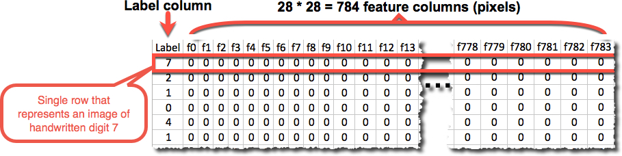  

First row (exluding the header, column names) of the 10K dataset represents an image of handwritten digit 7. If we convert this row data into an black-white (all pixel values >0 is converted to 255) image representation, it will look like:  
  

How we represent a one dimensional single row of data with 784 columns as 28 by 28 pixel size two dimensional image? Reshaping these 784 columns as 28 rows per line, we will get 28x28 pixel image (28 by 28 matrix).  
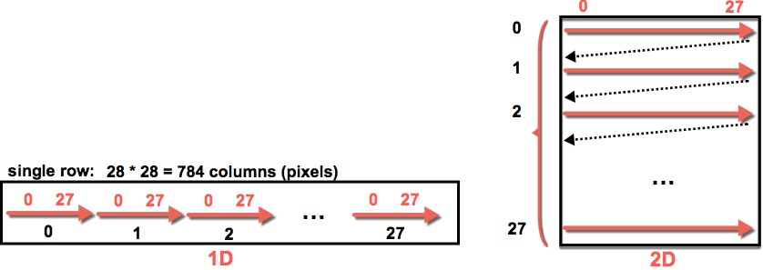  

which is in numerical representation:  
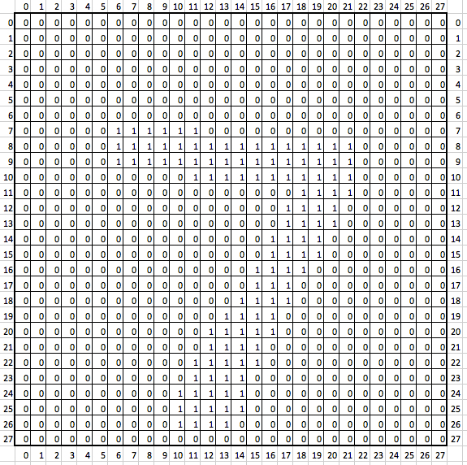  

### 10.2.1. Process MINST database in Azure ML with Python script
1. Open [Azure Machine Learning Studio](http://studio.azureml.net).  

1. Create a blank Azure Machine learning experiment.  
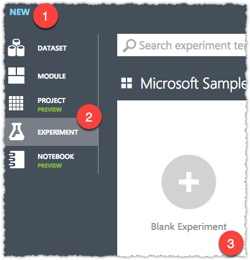  

1. Drop "MNIST Test 10k 28x28 dense" module on the experiment canvas.  
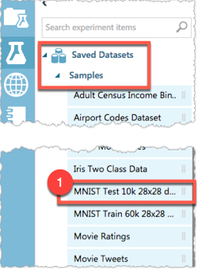  

1. Drop an "Execute Python Script" module and set its "Python Script" property with following script.  
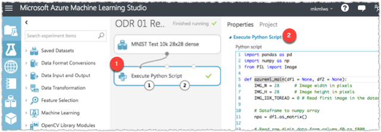  

    ```python  
    import pandas as pd
    import numpy as np
    from PIL import Image

    def azureml_main(df1 = None, df2 = None):
        IMG_W = 28      # Image width in pixels
        IMG_H = 28      # Image height in pixels
        IMG_IDX_TOREAD = 0 # Read first image in the dataset
            
        # Dataframe to numpy array 
        npa = df1.as_matrix()
                        
        # Read raw digit data from column f0 to f800...
        dgtpx = npa[IMG_IDX_TOREAD, 1:]                    
        
        # convert img data to marix form
        dgtpx = np.reshape(dgtpx, (IMG_H, IMG_W)).astype('uint8')
                
        # We will make on/off pixel count
        # Convert to binary, 0 & 1 (just black & white)
        dgtpx[np.where(dgtpx != 0)] = 1
        
        # Image func. accepts data ranges between 0 - 255 (black & white)
        # Multply w 255 so we have just 0 & 255s (no gray scale) 
        img = Image.fromarray(dgtpx * 255)
        img.save('digit.png')
            
        return pd.DataFrame(dgtpx),
    ```

1. Make connections and RUN the experiment. After execution finished, right click on the right output port (device output) of the "Execute Python Script" module and than click on "Visualize" menu item.  
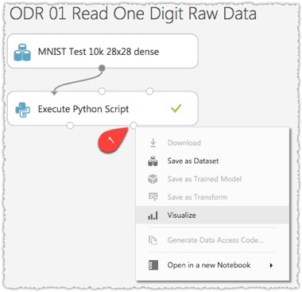  

1. On the output window, you will see the device output with saved image file.  
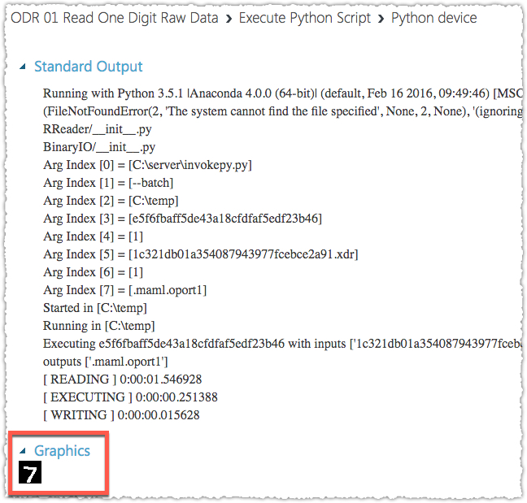  

### 10.2.2. Generate image tiles
1. If you want to draw all image data side by side to generate a tile of digit images in the database, you can use the following python script.
    ```python
    import pandas as pd
    import numpy as np
    import math
    from PIL import Image

    def azureml_main(df1 = None, df2 = None):
        IMG_W = 28      # Image width in pixels
        IMG_H = 28      # Image height in pixels
        IMG_C = 10000   # Image count, there are 10K images in the DB
            
                        # Tiling 100 * 100
        RES_H = 100     # Horizontally how many images in the final resulting image
        RES_W = 100     # Vertically how many images in the final resulting image
            
        # Dataframe to numpy array 
        npa = df1.as_matrix()
        
        res = np.zeros((RES_H * IMG_H, RES_W * IMG_W), dtype=np.uint8)
        x = 0
        y = 0
        for didx in range(0, IMG_C):
            # Read raw digit data from column f0 to f800...
            dgtpx = npa[didx, 1:] 
        
            dgtpx = np.reshape(dgtpx, (IMG_H, IMG_W))
        
            cy = y * IMG_H
            cx = x * IMG_W
            res[cy:cy+IMG_H, cx:cx+IMG_H] = dgtpx
        
            if y < RES_H - 1:
                y = y + 1
            else: 
                y = 0
                x = x + 1
        
        img = Image.fromarray(res)
        img.save('digit.png')

        return df1,    
    ```  
    
    drawing this images side by side will result the following final image:  
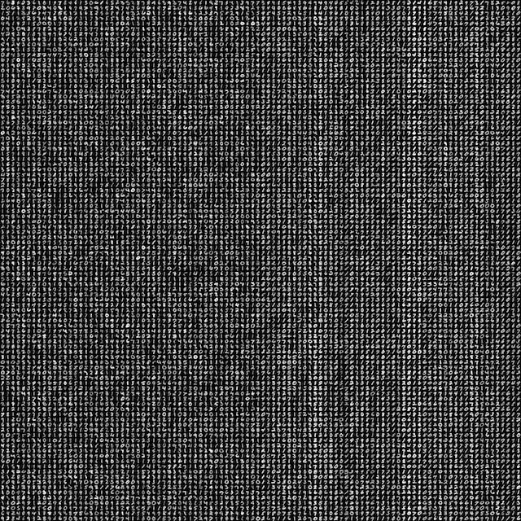  

1. Moreover, you can use "Apply SQL Transformation" module with following script property to sort the digits.  
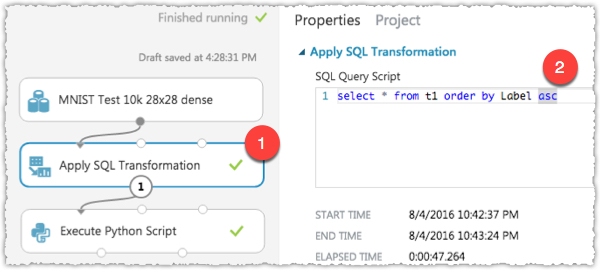  
    ```sql
    select * from t1 order by Label asc
    ```
    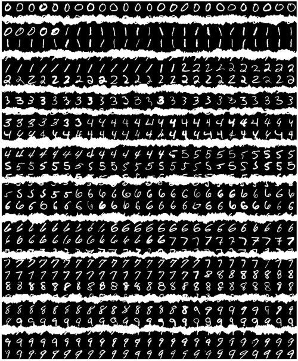  

## 10.3. Azure ML solution for OCR
Now we understand the contents of the database, how this handwritten digital images represented as pixels. In the following steps, we will develop an Azure ML solution to train a model to recognize any handwritten digital image.

### 10.3.1. Develope Azure ML experiment

1. Create a blank Azure Machine learning experiment.  
  

1. Drop the following modules and make the appropriate connections.
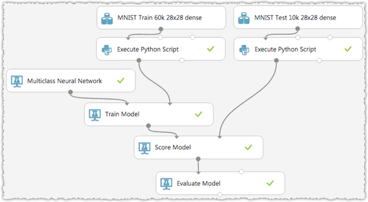  

1. Set both "Execute Python Script" modules properties to the following script:
    ```python
    import pandas as pd
    import numpy as np

    def azureml_main(df1 = None, df2 = None):
        npa = df1.as_matrix()
        
        dgtpx = npa[:, 1:]
        
        dgtpx[np.where(dgtpx != 0)] = 1
        
        npa[:, 1:] = dgtpx
        
        result = pd.DataFrame(npa)
        
        result.columns = df1.columns.values
            
        return result,
    ```
    This script will normalize the pixel values that range between 0 to 255 to 0 and 1. So values in 784 colums of the dataset will be either 0 or 1 (on or off pixel).

1. Set "Train Model" module's label property to **"Label"** with following steps.  
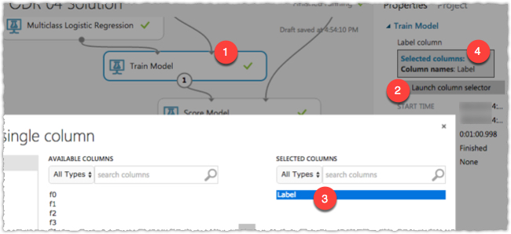  

1. Run the experiment.

1. If you visualize the output port of the "Evaluate Model" module, you will see the precision of the model's prediction.
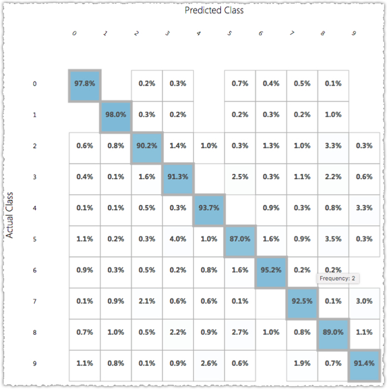  
as you can see from the matrix diagonal, model makes prediction almost with 90% precision, which is acceptable.

### 10.3.2. Deploy as webservice
1. Click on "Set up Web Service" button on the bottom toolbar.
  

1. Click on "Predictive Web Service [Recommended]" item on the popup menu.

1. On the "Predictive experiment" canvas, drag&drop two "Select Columns in Dataset" modules on the canvas.  
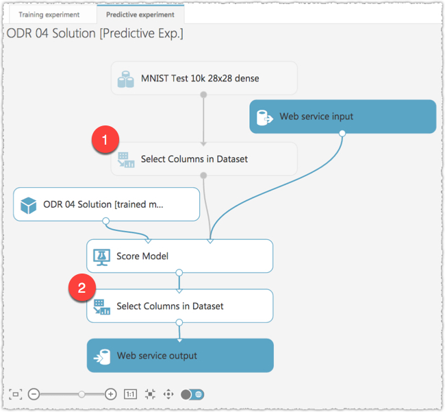  

1. Connect the I/O ports of the "Select Columns in Dataset" modules as shown on the above image.  

1. For the first "Select Columns in Dataset" module, click on the "Launch Column Selector" button on the properties window. Select 784 of the 785 column names (except the column named "Label"). And add them to the right bucket. Click "OK" button on the left bottom corner.  
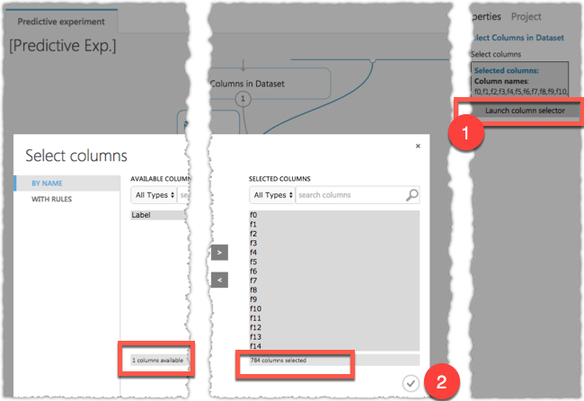  

1. For the second "Select Columns in Dataset" module, click on the "Launch Column Selector" button on the properties window. Select just the column named "Scored Labels". And add it to the right bucket. Click "OK" button on the left bottom corner.  

1. Save and then Run the experiment.  
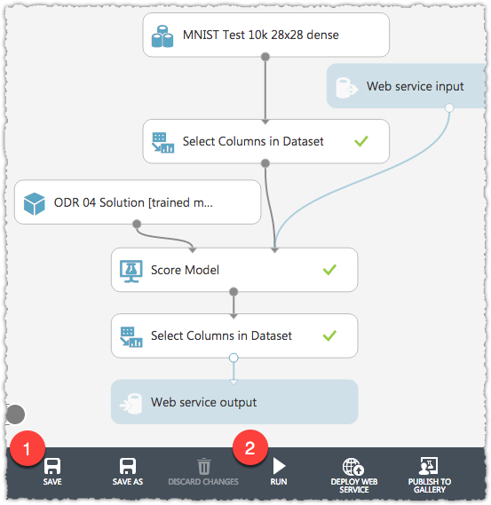  

1. Now click on "Deploy Web Service [Classic]" menu item under "Deploy Web Service".
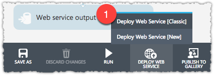  

### 10.3.3. Parameters needed to publish with management API
Take a note about the below **three** parameters of the published web service in the previous step. We will use them in the next section **10.4.**

1. Note the **"API Key"** (1st parameter to note) on the WebService dashboard page.  
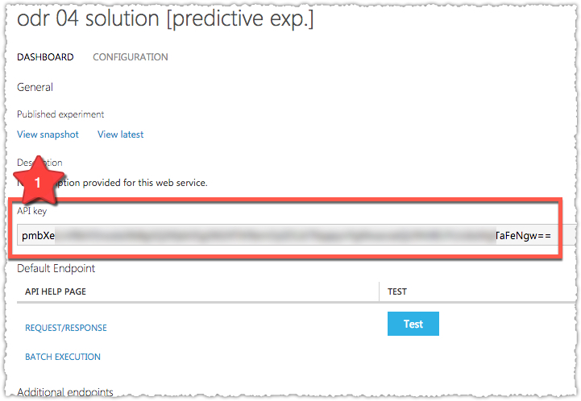  

1. Click on the "Request/Response" link on the same page (page in the prev. step).

1. Note the **"Request URI"** (2nd parameter to note) on the "Request/Response" dashboard page.
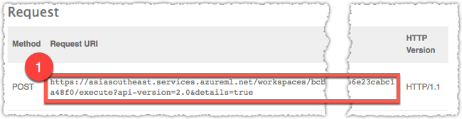  

1. On the same page, scroll down and note the **Sample Request** (3rd parameter to note) code. (in this case, very long lines of code with 785 parameters.)  
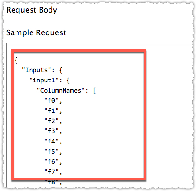  

## 10.4. Consuming the ML solution
Now, using the management API service (for details, check [Monetization hands-on-lab](./009-lab-monetization.md)), we will create a public, access controlled, CROS enabled endpoint for our ML Web service that we created in the prev. stage.

1. Create a new API Management service under the Azure management portal.   
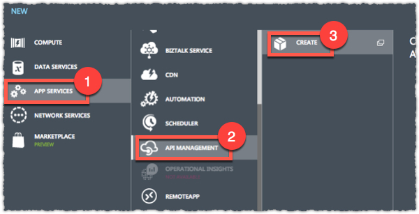  

1. Give a unique URL name and select a service region then click next (right arrow).  
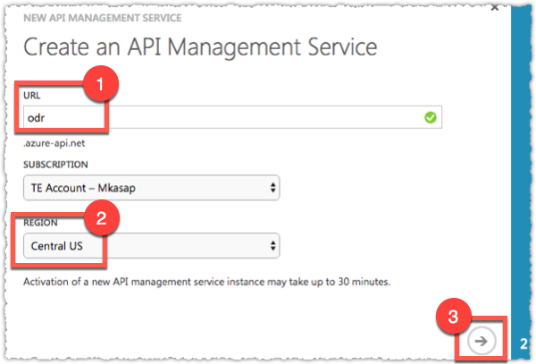  

1. Enter any organization name and your contact email address and click OK.
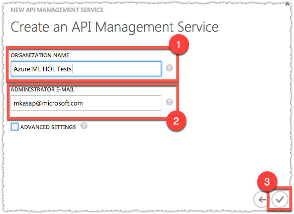  

1. Once the service created and the status is ready, click on the "Manage" button on the bottom bar.  
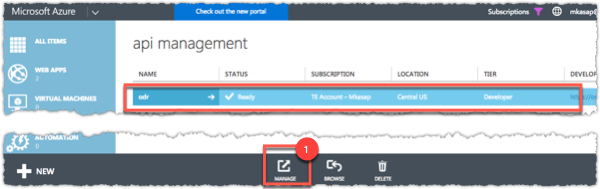  

1. On the management page, switch to API tab and click "Add API"  
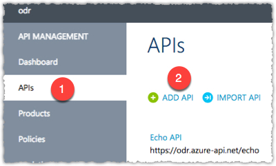  

1. Fill in the create API form. You can write any descriptive name to your API in the **Web API name** field. In this API namespace (https://odr.azure-api.net/) there may be more then one service. To identify this specific service give any name as a suffix in the **Web API URL suffix** field.  In the **Web service URL** field copy and paste the **Request URI** value that you noted in section **10.3.3-1.** But do not paste the suffix part of the **Request URI**.
i.e. if the URI is:  
*https://ussouthcentral.services.azureml.net/workspaces/4714.......bcc7fa7d7/execute?api-version=2.0&details=true*  
then just copy the following part:  
*https://ussouthcentral.services.azureml.net/workspaces/4714.......bcc7fa7d7*  
we will use the below suffix part in the following stages.  
*/execute?api-version=2.0&details=true*  
after all, you can press the save button to create the API and goto the operations page of the API.  
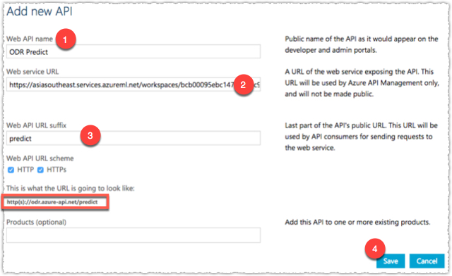  

1. On the **Operations** page, click on the **Add Operation** link.
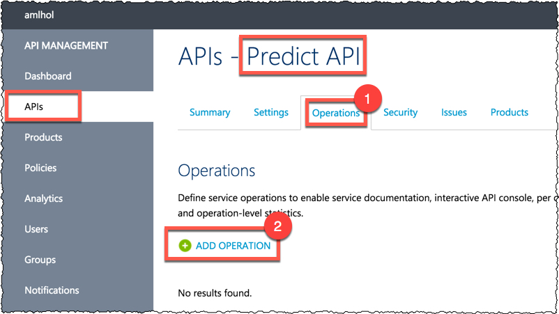  

1. On the **Signature** tab of the operations page select **POST** method in the **HTTP web** field.  
Enter any URL template (in this sample we will use **/score**) that will be replaced with the suffix ***/execute?api-version=2.0&details=true*** we noted in the previous step.  
Enter the ****/execute?api-version=2.0&details=true**** suffix in the **Rewrite URL template** field.  
You can customize the **Display Name** field with any value, otherwise it will be same as the **URL Template** value.  
After all press the save button.
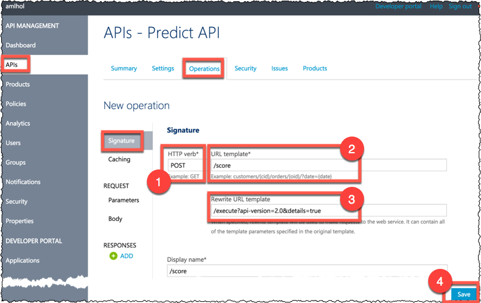  

1. In the *Body* page of the *Operations* tab of the API, click on the **Add Representation** link.  
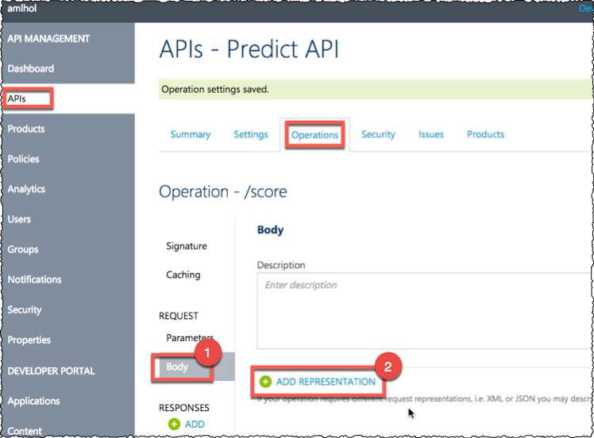  

1. Here type **application/json** and press *Enter*  
  

1. In the **Representation example** field paste the **Sample Request** value that we noted in the above section ****10.3.3-3**.**
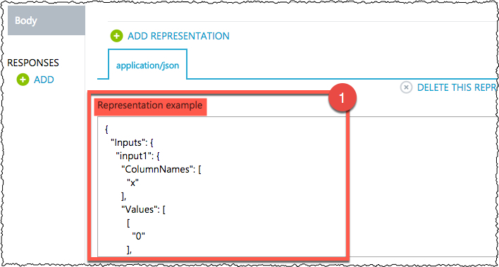  

1. Now switch to the **Policies** tab in the *API Management* page. Select **Predict API** and the **/score** operation in the combo boxes. Finally click on the **Configure Policy** link. On this page you can do lots of fun staff to customize your API.   
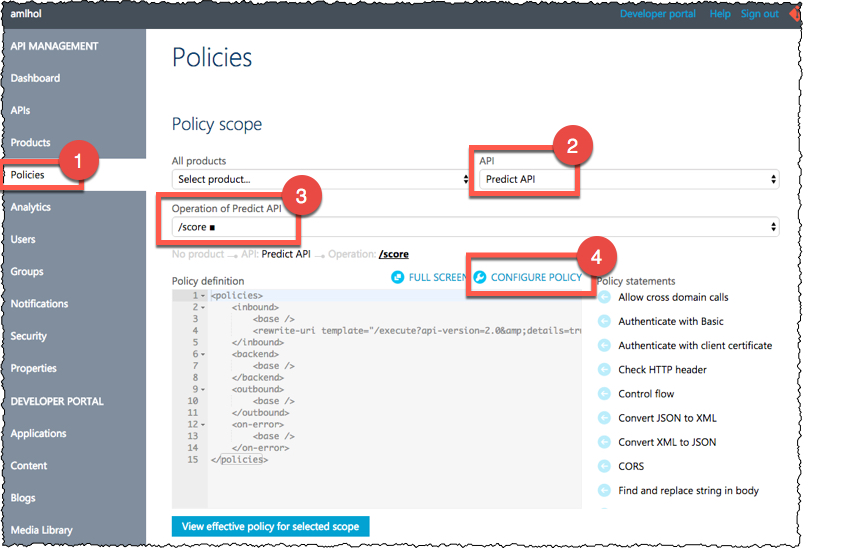  

1. After you click on the **Configure Policy** link, the *Policy definition* field will become editable.  
Press *Enter* key to create a blank line under **\<inbound>\<base/>** tags as shown in the below screenshot.  
In the **Policy statements** list, scroll down to find the **Set HTTP header** policy template in the list. Click on the arrow button near it. This will add the policy template under **\<inbound>\<base/>**.
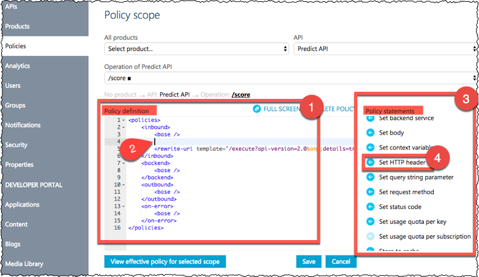  

1. After adding the template, it will look like: 
    ```xml
    <policies>
        <inbound>
            <base />
            <set-header name="header name" exists-action="override | skip | append | delete">
                <value>value</value> <!-- for multiple headers with the same name add additional value elements -->
            </set-header>
            <rewrite-uri template="/execute?api-version=2.0&amp;details=true" />
        </inbound>
        <backend>
            <base />
        </backend>
        <outbound>
            <base />
        </outbound>
        <on-error>
            <base />
        </on-error>
    </policies>
    ```

1. Update the above policy template with the **API Key** that you noted in section **10.3.3-1** Your **API Key** should be typed immediately after the **Bearer** keyword with a preciding space character as shown below.
 so it will look like as (Below sample uses random API Key):
    ``` xml
    <policies>
        <inbound>
            <base />
            <set-header name="Authorization" exists-action="override">
                <value>Bearer wJJx5JxpO6C......Tey2Zu/tzJpo+p5DWRg==</value> <!-- for multiple headers with the same name add additional value elements -->
            </set-header>
            <rewrite-uri template="/execute?api-version=2.0&amp;details=true" />
        </inbound>
        <backend>
            <base />
        </backend>
        <outbound>
            <base />
        </outbound>
        <on-error>
            <base />
        </on-error>
    </policies>
    ```

1. Make the last update by adding the following lines under **\<inbound>\<base/>** tag. You can either enter manually or use the *CORS* item under **policy statements** to insert it.  
    ``` xml
            <cors>
                <allowed-origins>
                    <origin>*</origin>
                </allowed-origins>
                <allowed-methods>
                    <method>*</method>
                </allowed-methods>
                <allowed-headers>
                    <header>*</header>
                </allowed-headers>
            </cors>
    ```

    This will allow any method, any IP address to acces from cross origin. Above settings doesnt have any restriction and generally you have to make modification on it to have secure web apps. Refer to the [following address](https://azure.microsoft.com/en-us/documentation/articles/api-management-policy-reference) to read more details on policy settings.

1. Finally click the **Save** button to save all these changes and finalize our API settings.  

### 10.4.1 Security of the API
For simplicity, we will let anyone to access our service. If you want to set authentication or call limit etc. to this web service, you can add as much user as you want throught the users/security tab and use the user specific keys (passwords) to access the web service.

1. Open the security tab. Set "Proxy authentication" and "User authorization" properties to "None" and save the state.  
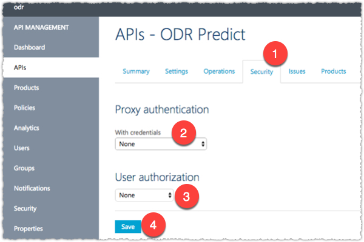  

1. Now, anyone, without authentication (highly recommended to set user authentication, see ) can access our webservice through the url address **"https://odr.azure-api.net/predict/score"** that was shown at step *10.4.-6*

## 10.5. Develop web application
In this step we will develop a web application (static webpage with javascript) that will use the web service created and published throug previous steps.

1. Create an empty folder on your computer, i.e. name it "ocrweb" as below. Change active directory to be "ocrweb" and open a code editor to develop our web application. We will use [**Visual Studio Code**](https://code.visualstudio.com) to create an "index.html" file and develop the application in the folder "ocrweb". Type the below commands on a command prompt in order.  
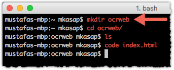  

1. Write the following html code inside the "index.html" file and save it.
    ```html
    <html>
    <head>
        <title>Optical Character Recognition with Microsoft Azure Machine Learning</title>
        <style>
            #imgView {
                border: 1px solid #FFFFFF;
            }
            
            #btnClear {
                background: gray;
                width: 280px;
                color: white;
                font-size: 2em;
            }

            #btnSend {
                background: gray;
                width: 280px;
                color: white;
                font-size: 2em;
            }
        </style>
    </head>

    <body>
        <canvas id="imgView" width="280" height="280">
            Unfortunately, your browser does not supported.
        </canvas>

        <p><button id="btnClear">Clear</button></p>
        <p><button id="btnSend">Send</button></p>

        <script src="http://ajax.googleapis.com/ajax/libs/jquery/1.9.1/jquery.min.js"></script>
        <script src="./odr.js"></script>
    </body>
    </html>
    ```

1. Now create another file (our javascript file that will do all the work) named **"odr.js"** and save it in the same folder **"ocrweb"**.  odr.js name is statically embedded into html file so any name change should be reflected there too.

1. Set the content of the **odr.js** file as:
    ```javascript
    window.addEventListener('load', function () {
        var canvas, context;
        var iw = 28; // image width
        var ih = 28; // image height 
        var s = 10;  // scale (in HTML the canvas size is 280px, mapping canvas size to MINST sample size 28x28)
        var dimg;    // digit pixels in 2D array

        function init() {
            canvas = document.getElementById('imgView');
            context = canvas.getContext('2d');
            drawtool = new canvasPencil();

            canvas.addEventListener('mousedown', drawtool.mousedown, false);
            canvas.addEventListener('mousemove', drawtool.mousemove, false);
            canvas.addEventListener('mouseup', drawtool.mouseup, false);
            canvas.addEventListener('mouseleave', drawtool.mouseup, false);

            var btnClear = document.getElementById("btnClear");
            btnClear.addEventListener("click", clearCanvas, false);

            var btnSend = document.getElementById("btnSend");
            btnSend.addEventListener("click", callWebService, false);

            drawCanvasGrid();

            dimg = new Array(ih);
            for (var i = 0; i < ih; i++) {
                dimg[i] = new Array(iw);
            }

            clearCanvas();
        }

        function canvasPencil() {
            var isMouseDown = false;
            var mouseX = 0;
            var mouseY = 0;

            this.mousedown = function (evt) {
                isMouseDown = true;

                mouseX = evt.offsetX;
                mouseY = evt.offsetY;

                context.beginPath();
                context.moveTo(mouseX, mouseY);
            };

            this.mousemove = function (evt) {
                if (isMouseDown) {
                    mouseX = evt.offsetX;
                    mouseY = evt.offsetY;

                    dx = Math.floor(mouseX / 10);
                    dy = Math.floor(mouseY / 10);

                    drawCanvasCell(dx, dy); // draw pixel on the canvas

                    dimg[dx][dy] = 1;  // set the same pixel on 2D array


                    // not a thin line, but a bold line, like the original digit drawings...
                    if (dx < 27 && dy < 27 && dx > 0 && dy > 0){
                        drawCanvasCell(dx, dy + 1);
                        drawCanvasCell(dx, dy - 1);
                        drawCanvasCell(dx + 1, dy + 1);
                        drawCanvasCell(dx + 1, dy);
                        drawCanvasCell(dx + 1, dy - 1);
                        drawCanvasCell(dx - 1, dy + 1);
                        drawCanvasCell(dx - 1, dy);
                        drawCanvasCell(dx - 1, dy - 1);

                        // not a thin line, but a bold line, like the original digit drawings...
                        dimg[dx][dy + 1]        = 1;
                        dimg[dx][dy - 1]        = 1;
                        dimg[dx + 1][dy + 1]    = 1;
                        dimg[dx + 1][dy]        = 1;
                        dimg[dx + 1][dy - 1]    = 1;
                        dimg[dx - 1][dy + 1]    = 1;
                        dimg[dx - 1][dy]        = 1;
                        dimg[dx - 1][dy - 1]    = 1;
                    }
                }
            };

            this.mouseup = function (evt) {
                isMouseDown = false;
            };
        }

        function clearCanvas() {
            canvas.width = canvas.width;
            drawCanvasGrid();

            for (var i = 0; i < ih; i++) {
                for (var j = 0; j < iw; j++) {
                    dimg[i][j] = 0;
                }
            }
        }

        function drawCanvasCell(x, y) {
            context.fillRect(x * s, y * s, s, s);
        }

        function drawCanvasGrid() {
            for (var x = 0; x <= iw; x += 1) {
                context.moveTo(x * s, 0);
                context.lineTo(x * s, ih * s);
            }

            for (var y = 0; y <= ih; y += 1) {
                context.moveTo(0, y * s);
                context.lineTo(iw * s, y * s);
            }

            context.stroke();
        }

        function callWebService() {
            var dimgarray = ""
            for (var i = 0; i < ih; i++) {
                    for (var j = 0; j < iw; j++) {
                        dimgarray += dimg[j][i] + ",";
                    }
                }
            dimgarray = dimgarray.slice(0, dimgarray.length - 1);

            var arg = {
                        "Inputs": {
                            "input1": {
                            "ColumnNames": ["f0", "f1", "f2", "f3", "f4", "f5", "f6", "f7", "f8", "f9", "f10", "f11", "f12", "f13", "f14", "f15", "f16", "f17", "f18", "f19", "f20", "f21", "f22", "f23", "f24", "f25", "f26", "f27", "f28", "f29", "f30", "f31", "f32", "f33", "f34", "f35", "f36", "f37", "f38", "f39", "f40", "f41", "f42", "f43", "f44", "f45", "f46", "f47", "f48", "f49", "f50", "f51", "f52", "f53", "f54", "f55", "f56", "f57", "f58", "f59", "f60", "f61", "f62", "f63", "f64", "f65", "f66", "f67", "f68", "f69", "f70", "f71", "f72", "f73", "f74", "f75", "f76", "f77", "f78", "f79", "f80", "f81", "f82", "f83", "f84", "f85", "f86", "f87", "f88", "f89", "f90", "f91", "f92", "f93", "f94", "f95", "f96", "f97", "f98", "f99", "f100", "f101", "f102", "f103", "f104", "f105", "f106", "f107", "f108", "f109", "f110", "f111", "f112", "f113", "f114", "f115", "f116", "f117", "f118", "f119", "f120", "f121", "f122", "f123", "f124", "f125", "f126", "f127", "f128", "f129", "f130", "f131", "f132", "f133", "f134", "f135", "f136", "f137", "f138", "f139", "f140", "f141", "f142", "f143", "f144", "f145", "f146", "f147", "f148", "f149", "f150", "f151", "f152", "f153", "f154", "f155", "f156", "f157", "f158", "f159", "f160", "f161", "f162", "f163", "f164", "f165", "f166", "f167", "f168", "f169", "f170", "f171", "f172", "f173", "f174", "f175", "f176", "f177", "f178", "f179", "f180", "f181", "f182", "f183", "f184", "f185", "f186", "f187", "f188", "f189", "f190", "f191", "f192", "f193", "f194", "f195", "f196", "f197", "f198", "f199", "f200", "f201", "f202", "f203", "f204", "f205", "f206", "f207", "f208", "f209", "f210", "f211", "f212", "f213", "f214", "f215", "f216", "f217", "f218", "f219", "f220", "f221", "f222", "f223", "f224", "f225", "f226", "f227", "f228", "f229", "f230", "f231", "f232", "f233", "f234", "f235", "f236", "f237", "f238", "f239", "f240", "f241", "f242", "f243", "f244", "f245", "f246", "f247", "f248", "f249", "f250", "f251", "f252", "f253", "f254", "f255", "f256", "f257", "f258", "f259", "f260", "f261", "f262", "f263", "f264", "f265", "f266", "f267", "f268", "f269", "f270", "f271", "f272", "f273", "f274", "f275", "f276", "f277", "f278", "f279", "f280", "f281", "f282", "f283", "f284", "f285", "f286", "f287", "f288", "f289", "f290", "f291", "f292", "f293", "f294", "f295", "f296", "f297", "f298", "f299", "f300", "f301", "f302", "f303", "f304", "f305", "f306", "f307", "f308", "f309", "f310", "f311", "f312", "f313", "f314", "f315", "f316", "f317", "f318", "f319", "f320", "f321", "f322", "f323", "f324", "f325", "f326", "f327", "f328", "f329", "f330", "f331", "f332", "f333", "f334", "f335", "f336", "f337", "f338", "f339", "f340", "f341", "f342", "f343", "f344", "f345", "f346", "f347", "f348", "f349", "f350", "f351", "f352", "f353", "f354", "f355", "f356", "f357", "f358", "f359", "f360", "f361", "f362", "f363", "f364", "f365", "f366", "f367", "f368", "f369", "f370", "f371", "f372", "f373", "f374", "f375", "f376", "f377", "f378", "f379", "f380", "f381", "f382", "f383", "f384", "f385", "f386", "f387", "f388", "f389", "f390", "f391", "f392", "f393", "f394", "f395", "f396", "f397", "f398", "f399", "f400", "f401", "f402", "f403", "f404", "f405", "f406", "f407", "f408", "f409", "f410", "f411", "f412", "f413", "f414", "f415", "f416", "f417", "f418", "f419", "f420", "f421", "f422", "f423", "f424", "f425", "f426", "f427", "f428", "f429", "f430", "f431", "f432", "f433", "f434", "f435", "f436", "f437", "f438", "f439", "f440", "f441", "f442", "f443", "f444", "f445", "f446", "f447", "f448", "f449", "f450", "f451", "f452", "f453", "f454", "f455", "f456", "f457", "f458", "f459", "f460", "f461", "f462", "f463", "f464", "f465", "f466", "f467", "f468", "f469", "f470", "f471", "f472", "f473", "f474", "f475", "f476", "f477", "f478", "f479", "f480", "f481", "f482", "f483", "f484", "f485", "f486", "f487", "f488", "f489", "f490", "f491", "f492", "f493", "f494", "f495", "f496", "f497", "f498", "f499", "f500", "f501", "f502", "f503", "f504", "f505", "f506", "f507", "f508", "f509", "f510", "f511", "f512", "f513", "f514", "f515", "f516", "f517", "f518", "f519", "f520", "f521", "f522", "f523", "f524", "f525", "f526", "f527", "f528", "f529", "f530", "f531", "f532", "f533", "f534", "f535", "f536", "f537", "f538", "f539", "f540", "f541", "f542", "f543", "f544", "f545", "f546", "f547", "f548", "f549", "f550", "f551", "f552", "f553", "f554", "f555", "f556", "f557", "f558", "f559", "f560", "f561", "f562", "f563", "f564", "f565", "f566", "f567", "f568", "f569", "f570", "f571", "f572", "f573", "f574", "f575", "f576", "f577", "f578", "f579", "f580", "f581", "f582", "f583", "f584", "f585", "f586", "f587", "f588", "f589", "f590", "f591", "f592", "f593", "f594", "f595", "f596", "f597", "f598", "f599", "f600", "f601", "f602", "f603", "f604", "f605", "f606", "f607", "f608", "f609", "f610", "f611", "f612", "f613", "f614", "f615", "f616", "f617", "f618", "f619", "f620", "f621", "f622", "f623", "f624", "f625", "f626", "f627", "f628", "f629", "f630", "f631", "f632", "f633", "f634", "f635", "f636", "f637", "f638", "f639", "f640", "f641", "f642", "f643", "f644", "f645", "f646", "f647", "f648", "f649", "f650", "f651", "f652", "f653", "f654", "f655", "f656", "f657", "f658", "f659", "f660", "f661", "f662", "f663", "f664", "f665", "f666", "f667", "f668", "f669", "f670", "f671", "f672", "f673", "f674", "f675", "f676", "f677", "f678", "f679", "f680", "f681", "f682", "f683", "f684", "f685", "f686", "f687", "f688", "f689", "f690", "f691", "f692", "f693", "f694", "f695", "f696", "f697", "f698", "f699", "f700", "f701", "f702", "f703", "f704", "f705", "f706", "f707", "f708", "f709", "f710", "f711", "f712", "f713", "f714", "f715", "f716", "f717", "f718", "f719", "f720", "f721", "f722", "f723", "f724", "f725", "f726", "f727", "f728", "f729", "f730", "f731", "f732", "f733", "f734", "f735", "f736", "f737", "f738", "f739", "f740", "f741", "f742", "f743", "f744", "f745", "f746", "f747", "f748", "f749", "f750", "f751", "f752", "f753", "f754", "f755", "f756", "f757", "f758", "f759", "f760", "f761", "f762", "f763", "f764", "f765", "f766", "f767", "f768", "f769", "f770", "f771", "f772", "f773", "f774", "f775", "f776", "f777", "f778", "f779", "f780", "f781", "f782", "f783"],
                            "Values": [ ]
                            }
                        },
                        "GlobalParameters": {}
            }

            p = JSON.parse("[" + dimgarray + "]");
            arg.Inputs.input1.Values.push(p);

            jQuery.ajax({
                url: "https://odr.azure-api.net/predict/score",
                beforeSend: function (xhrObj) {
                    xhrObj.setRequestHeader("Content-Type", "application/json");
                },
                type: "POST",
                data: JSON.stringify(arg)
            })
                .done(function (data) {
                    res = data.Results.output1.value.Values

                    $.each(res, function (index, element) {
                            alert("Result: " + element)
                    });
                })
                .fail(function () {
                    alert("error");
                });
        }

        init();
    }, false);
    ```
    This javascript code will allow us to draw digits on a canvas and send the pixel data to our ML service to retrive the prediction.

1. You can double click on the **index.html** file to open it from local copy and use it immediately. Instead we will publish it on Azure Web App service.

### 10.5.1. Publish as Azure Web Application
1. Using [Azure portal](http://portal.azure.com), create a new Azure Web App service. Follow the below steps.  
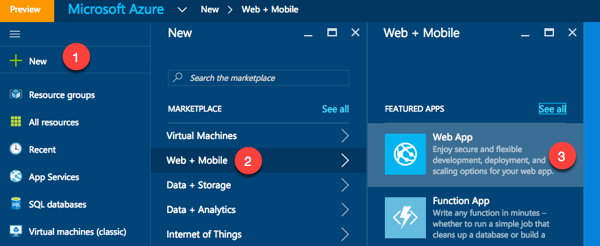  

1. Give an available Web app name and Resource group name then click on the create button.  
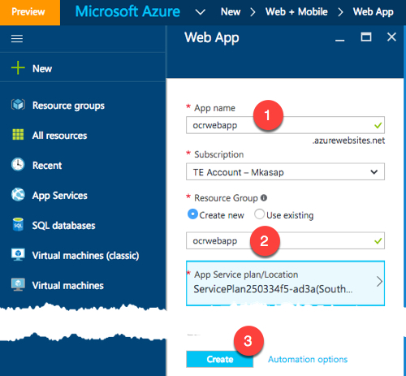  

1. After few seconds or later, once the web app created, follow the below steps to access the properties of the web app.  
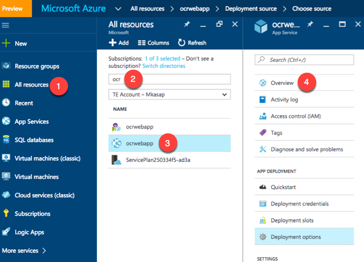  

1. On the properties blade of the newly created web app, click on "Deployment Credentials", set a username and password as your webapp deployment credentials and save it.  
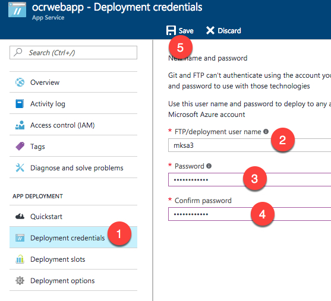  

1. Now switch to "Deployment Options" page on the same blade and set "Deployement Source" to "Local Git Repository" and save it.  
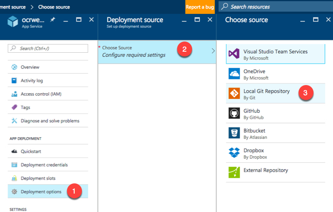  

1. Our web app is ready, just need to know the GIT repo address. Goto the overview page on the same blade and copy the GIT Clone URL.  
  

1. Using the command prompt window that we previously opened to create the **ocrweb** folder, continue with the following commands:  
    ```
    git init
    git add .
    git commit -m "initial commit"
    git remote add azure https://mksa3@ocrwebapp.scm.azurewebsites.net:443/ocrwebapp.git
    git push azure master

    -- type your password when asked...
    ```
    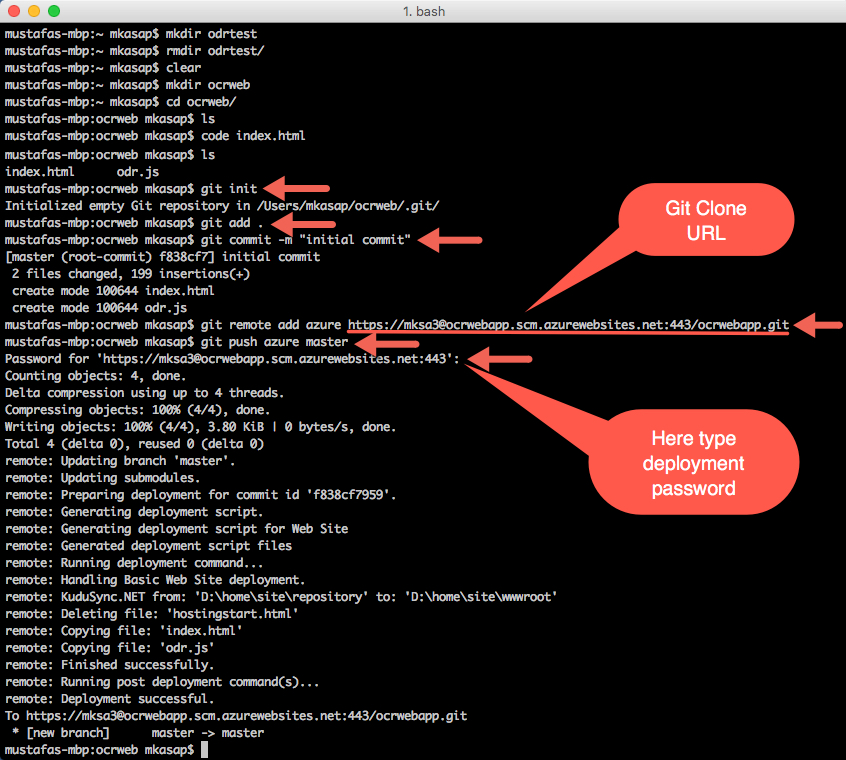  

1. Above process will deploy the web app files to your Azure Web App service. After successful deployment you can open the web page by clicking on the URL.  
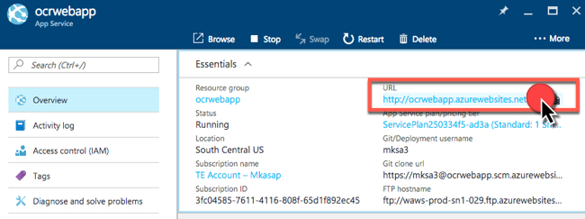  

## 10.6. Test the solution
1. On the web page, draw any digit on the canvas with 28x28 grid. Press SEND button to call the web service with the pixel values drawn on the canvas. There will be a dialog box showing the prediction result. 
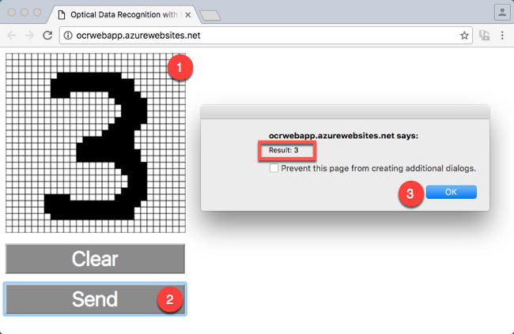  
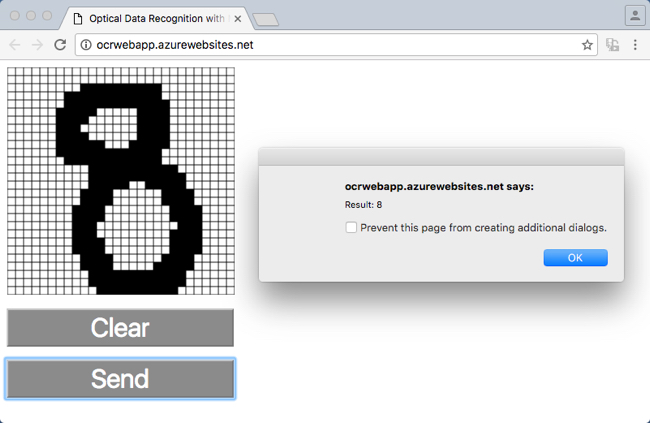  
There might be some error on the prediction. ML model may not recognize every of your drawing... You can try different classifier models and parameters in your ML model to improve the result. But more over sending 784 features to recognize a digit is not efficient. We need to make feature engineering, find more meaningful and less features i.e. 5-10 features instead of 784 with more reliable prediction results!

## 10.6. Refine features
In the above example we used 784 features to define a label. In our web service, we also send 784 boolean (for black-white image) values to the ML service. In production stage and for real scenarios this amount of data traffic for such case and the number of features used are not feasible.

For data traffic, instead of sending 784 boolean values, we can encode it at least into 784 / 8 = 98 byte data in bitwise manner, or compress it and decompress at the server-side etc.

For feature, using high amount of features doesnt mean or guarantee the realiability of the model. Working over data, we can reduce the features into smaller and meaningful set. Below we will show how to extract features.   

### Extracting features for object recognition
For the sake of simplicity, we will reduce our digit label set from 10 to 2 and we will create a set of features to detect only two digits: 1s and 0s.

Article by *Frey and Slate[1]* mentions how to detect different letters (Optical Character Recognition) with only 16 features. You may refer to the mentioned paper for more details and theory about this operation. Based on the techniques mentioned in this paper, we will use just the 4 of these features to detect if a digit is either 1 or 0. These features are: 

- The width, in pixels, of the bounding box. 
- The total number of "on" pixels in the digit image. 
- The mean number of edges (an "on" pixel immediately above either an "off" pixel or the image boundary) encountered when making systematic scans of the image from bottom to top over all horizontal positions within the box.
- The sum of horizontal positions of edges encountered as measured in the above. 

Below are the visual interpretation of the above first three items.

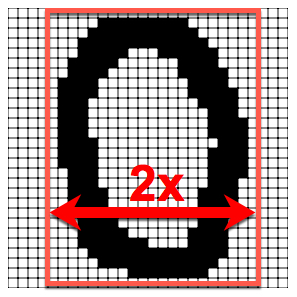
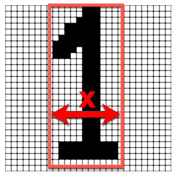  
Generally the width of the bounding box around digit 0 is almost two times larger than the one around digit 1.

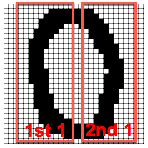
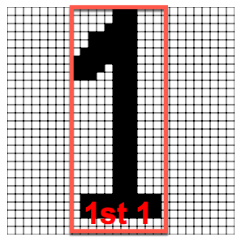  
If you divide the onpixels of digit 0 into two pieces as left and right side, number of on pixels in each side is almost equal to the on pixel count in digit 1. 


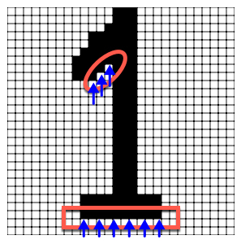  
Number of "on" pixel immediately above either an "off" pixel or the image boundary of digit 0 is almost two times more than the ones in digit 1.

These are some of the features that we can use for detecting if it is digit 1 or 0 image.

Based on the above features, we develop the following new ML experiment in Azure ML Studio to test the results.
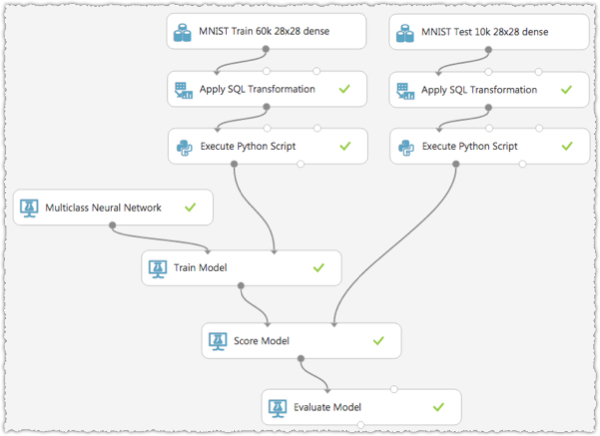  

Same dataset is used but to filter our just the digits 0s and 1s, we used "Apply SQL Transformation" module with the following SQL script in its script properties:
```SQL
select * from t1 where Label = 0 or label = 1
```
In addition, we process the resulting data with the following python script to generate the above mentioned 4 features along with the label. By this way, we reduce the number of columns in the input dataset from 785 to 5! A big decrease, less network traffic, shorter computation time etc.
```python
import pandas as pd
import numpy as np
import math
from PIL import Image

def bbox(img):
    rows = np.any(img, axis=1)
    cols = np.any(img, axis=0)
    rmin, rmax = np.where(rows)[0][[0, -1]]
    cmin, cmax = np.where(cols)[0][[0, -1]]

    return rmin, rmax, cmin, cmax

def azureml_main(df1 = None, df2 = None):
    IMG_W = 28      # Image width in pixels
    IMG_H = 28      # Image height in pixels
    IMG_C = 12665   # Image count (number of rows in the MINST60K DB with label = 0 or 1. For MINST10K DB it should be 2115)
    IMG_F = 5       # Number of columns w label and features to generate
    
    npa = df1.as_matrix()
    
    # Create empty features list
    res = np.array([]).reshape(0, IMG_F)            
                
    for didx in range(0, IMG_C):
        # Read raw digit data from column f0
        dgtpx = npa[didx, 1:] 
    
        # Convert to 2D pixel matrix representation
        dgtpx = np.reshape(dgtpx, (IMG_H, IMG_W))
        
        # Convert to binary (no gray scale)
        dgtpx[np.where(dgtpx != 0)] = 1
    
        # initialize processed digit variable
        curdgt = np.zeros((1, IMG_F))
        
        #0 Label of the current digit
        curdgt[0, 0] = npa[didx, 0]
    
        # bounding box of the digit 
        bb = bbox(dgtpx)
            
        # [1st feature] Width of the bounding boxes
        curdgt[0, 1] = (bb[3] - bb[2] + 1)
     
        # [2nd feature] Total number of "on" pixels
        curdgt[0, 2] = np.sum(np.sum(dgtpx, axis = 0), axis = 0) 
    
        # [3rd feature] The mean number of edges horizontal scan
        # Count on internal pixels
        ecnt = 0
        for r in range(IMG_H - 2, -1, -1):
            onpx = np.where(dgtpx[r, :] > 0)
            for c in onpx[0]:
                if dgtpx[r + 1, c] == 0:
                    ecnt += 1
        # Count bottom border
        ecnt += np.sum(np.where(dgtpx[IMG_H-1, :] > 0))
        curdgt[0, 3] = ecnt
    
        # [4th feature] The sum of the vertical positions of edges
        # Count on internal pixels
        hpcnt = 0
        for r in range(IMG_H - 2, -1, -1):
            onpx = np.where(dgtpx[r, :] > 0)
            for c in onpx[0]:
                if dgtpx[r + 1, c] == 0:
                    hpcnt += (r+1)
        curdgt[0, 4] = hpcnt
        
        # add processed digit data to dataset
        res = np.concatenate((res, curdgt))
    
    result = pd.DataFrame(res)
    return result,
```

If you check the confusion matrix of the above experiment, you will see that using 4 features instead of 784 will result in similar performance even better.  
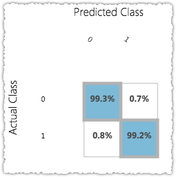  

For different type of object recognition, image processing etc. should we generate such features? It depends, this is where we need to jump to a new section on Deep Learning. A branch of machine learning where you can generate features from images automatically, without any interpretation!

[1] P. W. Frey and D. J. Slate (Machine Learning Vol 6/2 March 91): "Letter Recognition Using Holland-style Adaptive Classifiers"


