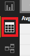
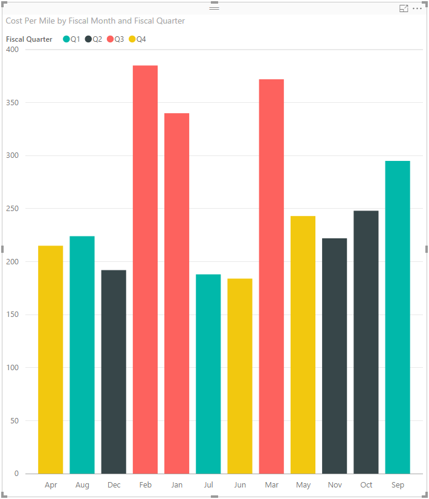
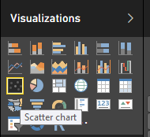
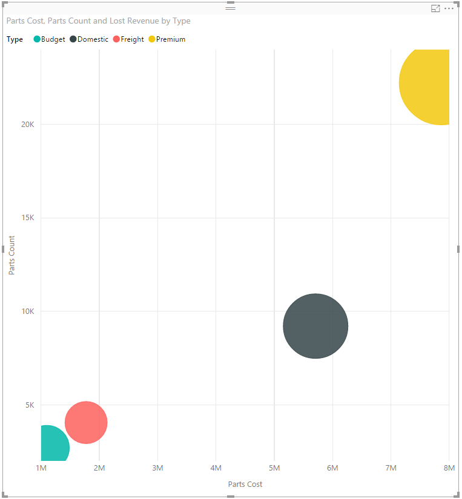
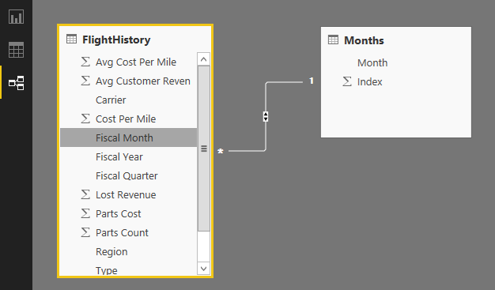

# 1. Using Power BI Desktop to Design a New Report
## 1.1. Overview
This lab is designed to familiarize the participant with the skills required to author/design a new Power BI report. 

### 1.1.1. Objectives

The lab will cover the following areas of report authoring:

- Getting data from a data source
- Adding visualizations onto a new Report and connecting to the data model
- Adding relationships to the model
- Using a play axis for temporal visualizations
- Show basic cross selection between visualizations

### 1.1.2. Requirements

You must have the following to complete this lab:

- Windows computer (Parallels on Mac is fine)
- Power BI Desktop (Free download: [https://powerbi.microsoft.com/en-us/desktop/](https://powerbi.microsoft.com/en-us/desktop/))

## 1.2. Create a New Report

1. Open the Power BI Desktop tool
2. Select **File -> New** (if skipping intro screen), otherwise **New Report** from intro screen

## 1.3. Get Data for the Report

1. Select **Get Data -> More...** from the ribbon
2. View the list of available data sources. Note that there is no indication of which sources support DirectQuery - the list currently is; *Azure SQL Database, Azure SQL Data Warehouse, Spark on Azure HDInsight, and SQL Server Analysis Services*.
3. From the **All** list select **CSV** and click the **Connect** button.
4. In the file picker dialog, navigate to `/Power BI Embedded/Data`. Select **FlightHistory.csv**. Click the **Open** button.
5. Observe that the data is parsed and the confirmation dialog presents reasonable data with associated column headings. Click the **Load** button to complete the import process.
6. Back in the report designer, click the **Data** button .
7. Verify that the data has been imported to a **FlightHistory** table with approx. 10000 rows of data.     

## 1.4. Add Visualizations to Report and Wire to Model

1. On the **Report** designer surface, select the **Line and Stacked Column Chart** icon from the Visualizations toolbox  and drag it to the top left area of the report page. Expand the size to fill the left hand side of the page.
2.  From the **Fields** selector list, click (in order) the **Cost Per Mile** (should go to the *Column Values* attribute) and **Fiscal Month** (should go to the *Shared Axis* attribute) columns. Drag the **Fiscal Quarter** field to the *Column Series* attribute. You should result in a visualization like this: 
3.  Click in a blank area of the report page to de-select the column chart visualization
4.  Click the **Scatter Chart** visualization.  Arrange it to fill the right half of the report page.
5.  From the **Fields** selector list, click (in order) the **Parts Cost** (should go to the *X Axis* attribute),  the **Parts Count** (should go to the *Y Axis* attribute) and the **Lost Revenue** (should go to the *Size* attribute) columns. Drag the **Type** field to the *Legend* attribute. You should result in a visualization like list: 

## 1.5. Add Relationships to the Model

Meaningful reports are rarely generated from a single entity type/table. Multiple entity types need to be related so that Power BI can connect the relationships. When using DirectQuery data sources, these relationships are expressed as joins. This is particularly useful for creating *Drill-Down* visualizations. It also helps us relate to data that visualizes the data better.

You may have noticed from the column chart in the previous step that the months in the X axis are ordered alphabetically. Given that we want this report to represent our financial year, we need a mechanism to tell Power BI how to order the months accordingly.

1. Select **Get Data -> CSV** from the ribbon. 
2. In the file picker dialog, navigate to `/Power BI Embedded/Data`. Select **Months.csv**. Click the **Open** button. Click the **Load** button in the data confirmation dialog.
3. Click the **Relationships** button to display the model's relationships.
4. Drag the **[FlightHistory]Fiscal Month** field onto the **[Months]Month** field. This should establish a *many to one* (*::1) relationship 
5. Click on the **Data** button. Select the **Months** table in the **Fields** selector list. Select the **Month** field in the table.
6. In the ribbon, select **Modeling -> Sort By Column**. Select the **Index** field. This tells Power BI that any time **Month** data is displayed, it should be ordered by it's associated **Index** value. This allows us now to order our monthly data by our financial year (which begins in July).
7. Return to the **Report** surface. Select the Column Chart visualization. Note that the month names in the X axis are still ordered alphabetically (and the financial quarters are ungrouped). Remove the **Fiscal Month** from the *Shared Axis* attribute and replace it with the **Month** field from the **Months** table.
8. Note now that the X axis months are ordered Jul-Jun and the financial quarters are grouped together. This is because Power BI has used the relationship between the **FlightHistory** and **Months** tables and then the *Sort By Column* attribute to provide us the expected ordering. 

## 1.6. Using a Play Axis for Temporal Visualizations

Power BI has the ability to animate reports. A most useful application of this feature is to show how data changes over time. Given that we have date oriented data in our model already, we can use the **Play Axis** feature of the **Scatter Chart** visualization to enable this.

1. Select the **Scatter Chart** visualization in the report.
2. Drag the **[Months]Month** field onto the *Play Axis* attribute. Note that the axis retains our desired financial calendar ordering.
3. Click the play button to set the report in motion. Note how the current month is displayed in the top right corner.
4. As the report animates, click on 1 of the bubbles to see a *trajectory* line and artifacts displayed.

## 1.7. Show Basic Cross Selection Between Visualizations

The **Scatter Chart** visualization has a legend/series using the **Type** field. Although we didn't explicitly reference the **Type** field in the **Column Chart** visualization, we can take advantage of a feature called *Cross Selection* to see how selection in one visualization can filter/affect the data shown in a separate visualization.

1. Click one of the bubbles in the **Scatter Chart** visualization.
2. Note how all other series in the same visualization loose their color saturation.
3. In the **Column Chart** visualization note how each column is now separated into two sections. The saturated color section represents the values associated with the selected **Type** field value. The unsaturated values represent all other values. 
4. Repeat these steps for other **Type** bubbles and observe how the sections in the Column Chart change to reflect the current selection. 

## 1.8. Save the Report for Later Uploading

1. Click the **Save** button to save the report. Remember the name that you assign to the pbix file as that will be required later when we upload this report to the *Power BI Embedded* service.

