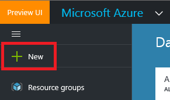
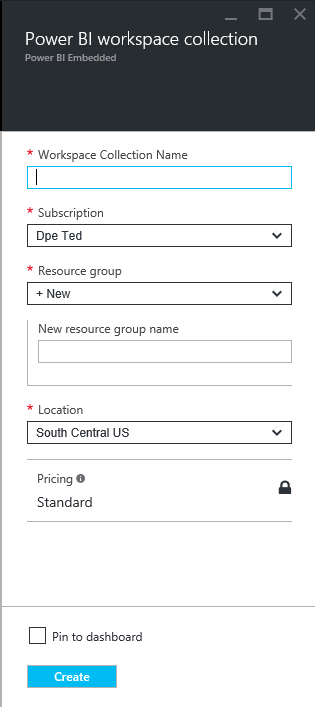

# 2. Embedding Power BI Reports into an Application
## 2.1. Overview
This lab is designed to familiarize the participant with the steps required to embed Power BI reports into an ASP.NET application. Although this lab is specific to ASP.NET, the concepts are applicable to other environments, including Single Page Application (SPA) JavaScript web apps. 

### 2.1.1. Objectives

The lab will cover the following areas for embedding reports:

- Creation of Power BI Workspace Collection resources using the Azure Portal
- Introduction to Power BI Embedded APIs
- Access tokens for authorizing access to PBI APIs
- Application code to upload new reports
- Server-side and client-side code to render embedded reports

### 2.1.2. Requirements

You must have the following to complete this lab:

- Visual Studio 2015
- Co-administrator access to an Azure Subscription

## 2.2. The Sample Application

1. Open the sample application solution in Visual Studio: `/Power BI Embedded/powerbi-sample-app/powerbi-sample-app.sln`
2. Restore the missing NuGet packages by right-clicking on the **Solution** item in the **Solution Explorer** window. Select **Restore NuGet Packages** from the context menu.
3. Expand the **References** item in the project. Observe the **Microsoft.PowerBI...** assemblies that have been downloaded from NuGet.
4. Build the application by selecting the **Build -> Build Solution** menu item. You should have 0 errors and 0 warnings.
5. Run the application to verify that the *IISExpress* site has been successfully registered and that the app runs without issue.

## 2.3 Create a Power BI Workspace Collection

1. The **Workspace Collection** is the top level container for all *Power BI Embedded* resources. Workspace Collections may be created and viewed in the Azure Portal.
2. Open the **Azure Portal** ([https://portal.azure.com](https://portal.azure.com)). Sign in using an identity that has co-administrator access to at least 1 *Azure Subscription*.
3. Click the **+ New** button in the top-left corner of the portal 
4. Select **Data + Analytics -> Power BI Embedded** to display the creation blade 
5. Enter an unique name for the **Workspace Collection Name** field. Select the desired subscription and resource group (or create a new one). Currently, Power BI Embedded is only available in 1 region - South Central US - more regions will follow shortly. There is also only 1 pricing SKU. Check the **Pin to Dashboard** checkbox, so that the workspace collection may be easily accessed once it has been created. 
6. Click the **Create** button to create the Power BI Workspace Collection.
7. Once the workspace collection has been created, open it's blade to see the settings.
8. From the **Settings** blade, select the **Access Keys** link to display the **Access Keys** blade.
9. Use the **Copy** button to copy one of the access keys to the clipboard. Save this value in a temporary location (eg. in Notepad)

## 2.4 Set the Configuration For the Application

1. Return to the sample application solution in Visual Studio.
2. Open the **web.config** file in the project root.
3. In the `<configuration><appSettings>` section, identify the following keys and set the associated values:
	- `powerbi:WorkspaceCollection` - the name of the previously created **Workspace Collection**
	- `powerbi:SigningKey` - the value of the previously saved **Access Key** for the workspace collection.
4. The above values will be used by the sample application to securely access resources in the workspace collection

## 2.5 Enumerating Uploaded Reports

1. Open **Controllers/DashboardController.cs**
2. In the constructor, observe how a mapping is read from `web.config` to provide display names for workspaces. In a real application, this logic would be contained within the operational store, such as a database. Other attributes, such as end-user access control, ordering, hierarchy, etc. would also be applied here.
3. Look at the `Reports()` action. It calls `GetWorkspaceReports()` to enumerate the list of reports for each configured workspace. Initially, there will be no workspaces in our workspace collection, but we will add them when we upload reports later.

## 2.6 Power BI Access Tokens

1. Have a look at the `PowerBIReportClient` constructor. Note how it is calling token functions from the *Power BI SDK*. There are 3 types of access tokens that perform different functions in the Power BI API:
	- `PowerBIToken.CreateDevToken()` - This type of token is required to enumerate and query Power BI resources and objects
	- `PowerBIToken.CreateProvisionToken()` - This type of token is required for manipulation of **Workspaces**.
	- `PowerBIToken.CreateReportEmbedToken()` - This token type will enable the rendering of reports in an application. 
2. Note that for environments where the Power BI SDK cannot be used, token creation is a manual process which is documented ??.
3. A `PowerBIToken` object is insufficient on its own to perform Power BI API operations. However, this token object is used in conjunction with the Workspace Collection **Access Key** to create an `IPowerBIClient` which may be used to interact with the service.

## 2.7 Upload a New Report

1. Look at the code for `DashboardController.Upload()` action. Note that it receives a normal model object bound to form controls, including a `HttpPostedFileBase` object which is the desired report .pbix file stream from the client. 
2. Observe the code that checks if a new Workspace should be created. Again, the mapping to additional Workspace attributes in normally an application specific exercise.
3. Observe the code that posts the new report and returns an `Import` object. The status of the `Import` object may be polled to determine when the report has been successfully imported.
4. Note: If the report was using a *DirectQuery* data source, the connection information (including the actual server and credentials) would be assigned at this point. In this sample, the data is embedded within the report.

## 2.8 Render Reports Within the Application

1. Look at the `DashboardController.Report()` action. Note that it has two arguments; `workspaceId` and `reportId`. These were previously established by the render code in **Views/Shared/Reports.cshtml** when constructing the report hierarchy.
2. The key logic in this handler is to return the `Report` object and generate an *Embed Token*.
3. Open **Views/Dashboard/Report.cshtml** (this is the view renderer for the above action). Observe that it contains essentially only two lines of code to render the report. The `powerbi.js` module and the `Microsoft.PowerBI.AspNet.Mvc` helper assembly take care of emitting the appropriate client objects and co-ordinating the events for the `<Iframe>`.

## 2.9 Run the Application, Upload Your Report and Render it in the Application

1. Upload the report you authored in the previous lab using the application.
2. Find the report in the nav bar menu. Select it to render the report in the application.
3. Interact with the report (including *Cross Selection* and *Filtering*) as you would normally do for any Power BI report. 
     